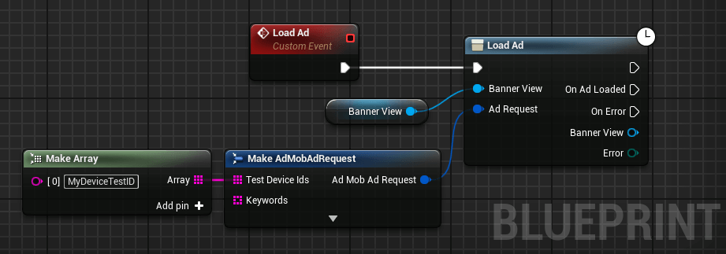
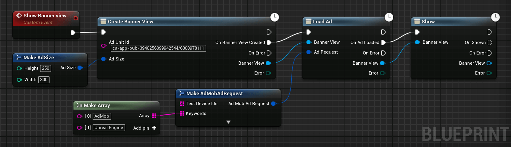
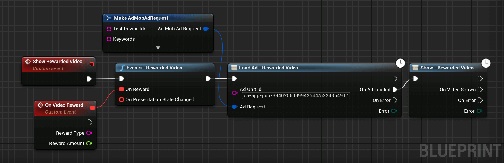
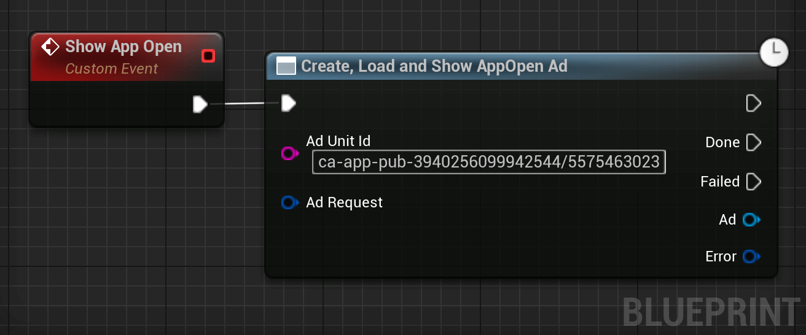
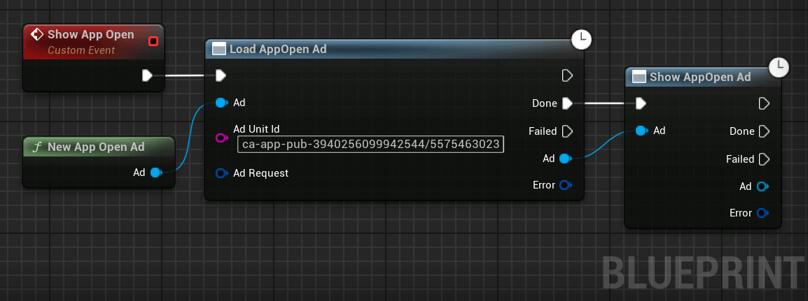

# AdMob

<style>
.markdown-section h2 {
   border-top: 4px solid #333;
   padding-top: 35px;
}
</style>

This section covers how to use AdMob with the Firebase - Features plugin.  
AdMob helps you monetize your mobile app through in-app advertising. Three types of advertising are available.

?> For development, you should pick a [Sample ad unit ID](https://developers.google.com/admob/android/test-ads#sample_ad_units) or your AdMob account might be flagged.

## Setting up AdMob for development  
For development, AdMob displays test ads instead of real ads. To enable test ads there are two possibilities.
### Using Test Ad IDs
Instead of using created ads' IDs, you can pick the one matching the type of ad you display to automatically use test ads:

<div class="centered">

|Ad Type| Ad ID|
|:---|:---|
|Banner|`ca-app-pub-3940256099942544/6300978111`|
|Interstitial|`ca-app-pub-3940256099942544/1033173712`|
|Interstitial Video|`ca-app-pub-3940256099942544/8691691433`|
|Rewarded Video|`ca-app-pub-3940256099942544/5224354917`|

</div>

You would then pass these Ads IDs for the parameter `Ad Unit Id`.

You can read more about these ads IDs [here](https://developers.google.com/admob/android/test-ads#sample_ad_units).

### Adding the Device ID for Development

A more convenient method to not have to change Ad Unit IDs is to register your device as a Test Device.

To do so:
1. Get your Test Device ID. You get it watching your device logs with `adb logcat` when you launch an ad. A line looking like `AdRequest.Builder.addTestDevice("YOUR_DEVICE_TEST_ID")` will appear in the logs.
2. Each time you load an ad, add your test device ID(s) to the ad request as followed:  

<div class="code-switcher show-cpp-true">
<div class="switcher" >
<span class="sw-bp" onclick="switchBp()">Blueprints</span><span class="sw-cpp" onclick="switchCpp()">C++</span>
</div>
<div class="cpp">

```cpp
FAdMobAdRequest Request;
Request.TestAdDeviceId = { TEXT("MyDeviceTestID") };

MyAd->LoadAd(Request);
```

</div>
<div class="bp">
<div class="bpcode">
<textarea readonly>
Begin Object Class=/Script/BlueprintGraph.K2Node_AsyncAction Name="K2Node_AsyncAction_75"
   ProxyFactoryFunctionName="LoadAd"
   ProxyFactoryClass=Class'"/Script/FirebaseFeatures.LoadAdBannerView"'
   ProxyClass=Class'"/Script/FirebaseFeatures.LoadAdBannerView"'
   NodePosX=3856
   NodePosY=-5072
   NodeGuid=E2B7E89B417CAA67A4308EA79AFC187B
   CustomProperties Pin (PinId=3DE4DAD14A6073AAD84A75A1E6C4EE57,PinName="execute",PinType.PinCategory="exec",PinType.PinSubCategory="",PinType.PinSubCategoryObject=None,PinType.PinSubCategoryMemberReference=(),PinType.PinValueType=(),PinType.ContainerType=None,PinType.bIsReference=False,PinType.bIsConst=False,PinType.bIsWeakPointer=False,PinType.bIsUObjectWrapper=False,LinkedTo=(K2Node_CustomEvent_6 22595CDF4344D3403D70D09AAA93A5B1,),PersistentGuid=00000000000000000000000000000000,bHidden=False,bNotConnectable=False,bDefaultValueIsReadOnly=False,bDefaultValueIsIgnored=False,bAdvancedView=False,bOrphanedPin=False,)
   CustomProperties Pin (PinId=72A60F9F4319A877219EAB970CC5ABFB,PinName="then",Direction="EGPD_Output",PinType.PinCategory="exec",PinType.PinSubCategory="",PinType.PinSubCategoryObject=None,PinType.PinSubCategoryMemberReference=(),PinType.PinValueType=(),PinType.ContainerType=None,PinType.bIsReference=False,PinType.bIsConst=False,PinType.bIsWeakPointer=False,PinType.bIsUObjectWrapper=False,PersistentGuid=00000000000000000000000000000000,bHidden=False,bNotConnectable=False,bDefaultValueIsReadOnly=False,bDefaultValueIsIgnored=False,bAdvancedView=False,bOrphanedPin=False,)
   CustomProperties Pin (PinId=7485657E499E8150FA1E3DACECB79B89,PinName="OnAdLoaded",PinFriendlyName="On Ad Loaded",PinToolTip="On Ad Loaded",Direction="EGPD_Output",PinType.PinCategory="exec",PinType.PinSubCategory="",PinType.PinSubCategoryObject=None,PinType.PinSubCategoryMemberReference=(),PinType.PinValueType=(),PinType.ContainerType=None,PinType.bIsReference=False,PinType.bIsConst=False,PinType.bIsWeakPointer=False,PinType.bIsUObjectWrapper=False,PersistentGuid=00000000000000000000000000000000,bHidden=False,bNotConnectable=False,bDefaultValueIsReadOnly=False,bDefaultValueIsIgnored=False,bAdvancedView=False,bOrphanedPin=False,)
   CustomProperties Pin (PinId=219EAA4F4D530526F5CD248EA8D2D465,PinName="OnError",PinFriendlyName="On Error",PinToolTip="On Error",Direction="EGPD_Output",PinType.PinCategory="exec",PinType.PinSubCategory="",PinType.PinSubCategoryObject=None,PinType.PinSubCategoryMemberReference=(),PinType.PinValueType=(),PinType.ContainerType=None,PinType.bIsReference=False,PinType.bIsConst=False,PinType.bIsWeakPointer=False,PinType.bIsUObjectWrapper=False,PersistentGuid=00000000000000000000000000000000,bHidden=False,bNotConnectable=False,bDefaultValueIsReadOnly=False,bDefaultValueIsIgnored=False,bAdvancedView=False,bOrphanedPin=False,)
   CustomProperties Pin (PinId=5892D59D4B709C342FF21095548E72CD,PinName="BannerView",PinToolTip="Banner View",Direction="EGPD_Output",PinType.PinCategory="object",PinType.PinSubCategory="",PinType.PinSubCategoryObject=Class'"/Script/FirebaseFeatures.BannerView"',PinType.PinSubCategoryMemberReference=(),PinType.PinValueType=(),PinType.ContainerType=None,PinType.bIsReference=False,PinType.bIsConst=False,PinType.bIsWeakPointer=False,PinType.bIsUObjectWrapper=False,PersistentGuid=00000000000000000000000000000000,bHidden=False,bNotConnectable=False,bDefaultValueIsReadOnly=False,bDefaultValueIsIgnored=False,bAdvancedView=False,bOrphanedPin=False,)
   CustomProperties Pin (PinId=894C115B4FBF68CABF32E1A0F11A9C65,PinName="Error",PinToolTip="Error",Direction="EGPD_Output",PinType.PinCategory="byte",PinType.PinSubCategory="",PinType.PinSubCategoryObject=Enum'"/Script/FirebaseFeatures.EAdMobError"',PinType.PinSubCategoryMemberReference=(),PinType.PinValueType=(),PinType.ContainerType=None,PinType.bIsReference=False,PinType.bIsConst=True,PinType.bIsWeakPointer=False,PinType.bIsUObjectWrapper=False,PersistentGuid=00000000000000000000000000000000,bHidden=False,bNotConnectable=False,bDefaultValueIsReadOnly=False,bDefaultValueIsIgnored=False,bAdvancedView=False,bOrphanedPin=False,)
   CustomProperties Pin (PinId=F4E734244C64ECDBCEBE079C4CE7B919,PinName="BannerView",PinType.PinCategory="object",PinType.PinSubCategory="",PinType.PinSubCategoryObject=Class'"/Script/FirebaseFeatures.BannerView"',PinType.PinSubCategoryMemberReference=(),PinType.PinValueType=(),PinType.ContainerType=None,PinType.bIsReference=False,PinType.bIsConst=True,PinType.bIsWeakPointer=False,PinType.bIsUObjectWrapper=False,LinkedTo=(K2Node_VariableGet_0 84CCEE1E4B142D1D8FBDC08D6E829698,),PersistentGuid=00000000000000000000000000000000,bHidden=False,bNotConnectable=False,bDefaultValueIsReadOnly=False,bDefaultValueIsIgnored=False,bAdvancedView=False,bOrphanedPin=False,)
   CustomProperties Pin (PinId=11EA430B432F9644E80C1F9ABD4578AC,PinName="AdRequest",PinType.PinCategory="struct",PinType.PinSubCategory="",PinType.PinSubCategoryObject=ScriptStruct'"/Script/FirebaseFeatures.AdMobAdRequest"',PinType.PinSubCategoryMemberReference=(),PinType.PinValueType=(),PinType.ContainerType=None,PinType.bIsReference=True,PinType.bIsConst=True,PinType.bIsWeakPointer=False,PinType.bIsUObjectWrapper=False,LinkedTo=(K2Node_MakeStruct_4 7522A899448CE93C92F62480C1023678,),PersistentGuid=00000000000000000000000000000000,bHidden=False,bNotConnectable=False,bDefaultValueIsReadOnly=False,bDefaultValueIsIgnored=True,bAdvancedView=False,bOrphanedPin=False,)
End Object
Begin Object Class=/Script/BlueprintGraph.K2Node_MakeStruct Name="K2Node_MakeStruct_4"
   bMadeAfterOverridePinRemoval=True
   ShowPinForProperties(0)=(PropertyName="TestDeviceIds",PropertyFriendlyName="Test Device Ids",PropertyTooltip="An array of test device IDs specifying devices that test ads will be\nreturned for.",CategoryName="AdMob",bShowPin=True,bCanToggleVisibility=True)
   ShowPinForProperties(1)=(PropertyName="Keywords",PropertyFriendlyName="Keywords",PropertyTooltip="An array of keywords or phrases describing the current user activity, such\nas \"Sports Scores\" or \"Football.\"",CategoryName="AdMob",bShowPin=True,bCanToggleVisibility=True)
   ShowPinForProperties(2)=(PropertyName="Extras",PropertyFriendlyName="Extras",PropertyTooltip="A @ref KeyValuePair specifying additional parameters accepted by an ad\nnetwork.",CategoryName="AdMob",bShowPin=True,bCanToggleVisibility=True)
   ShowPinForProperties(3)=(PropertyName="BirthdayDay",PropertyFriendlyName="Birthday Day",PropertyTooltip="The day the user was born. Specify the user\'s birthday to increase ad\nrelevancy.",CategoryName="AdMob",bShowPin=True,bCanToggleVisibility=True)
   ShowPinForProperties(4)=(PropertyName="BirthdayMonth",PropertyFriendlyName="Birthday Month",PropertyTooltip="The month the user was born. Specify the user\'s birthday to increase ad\nrelevancy.",CategoryName="AdMob",bShowPin=True,bCanToggleVisibility=True)
   ShowPinForProperties(5)=(PropertyName="BirthdayYear",PropertyFriendlyName="Birthday Year",PropertyTooltip="The year the user was born. Specify the user\'s birthday to increase ad\nrelevancy.",CategoryName="AdMob",bShowPin=True,bCanToggleVisibility=True)
   ShowPinForProperties(6)=(PropertyName="Gender",PropertyFriendlyName="Gender",PropertyTooltip="The user\'s @ref Gender. Specify the user\'s gender to increase ad\nrelevancy.",CategoryName="AdMob",bShowPin=True,bCanToggleVisibility=True)
   ShowPinForProperties(7)=(PropertyName="TaggedForChildDirectedTreatment",PropertyFriendlyName="Tagged for Child Directed Treatment",PropertyTooltip="Specifies whether the request should be considered as child-directed for\npurposes of the Children\'s Online Privacy Protection Act (COPPA).",CategoryName="AdMob",bShowPin=True,bCanToggleVisibility=True)
   StructType=ScriptStruct'"/Script/FirebaseFeatures.AdMobAdRequest"'
   NodePosX=3552
   NodePosY=-4928
   AdvancedPinDisplay=Hidden
   NodeGuid=E64AD4AA498D7A1AD7AF4181D020817C
   CustomProperties Pin (PinId=7522A899448CE93C92F62480C1023678,PinName="AdMobAdRequest",Direction="EGPD_Output",PinType.PinCategory="struct",PinType.PinSubCategory="",PinType.PinSubCategoryObject=ScriptStruct'"/Script/FirebaseFeatures.AdMobAdRequest"',PinType.PinSubCategoryMemberReference=(),PinType.PinValueType=(),PinType.ContainerType=None,PinType.bIsReference=False,PinType.bIsConst=False,PinType.bIsWeakPointer=False,PinType.bIsUObjectWrapper=False,LinkedTo=(K2Node_AsyncAction_75 11EA430B432F9644E80C1F9ABD4578AC,),PersistentGuid=00000000000000000000000000000000,bHidden=False,bNotConnectable=False,bDefaultValueIsReadOnly=False,bDefaultValueIsIgnored=False,bAdvancedView=False,bOrphanedPin=False,)
   CustomProperties Pin (PinId=3A3BCC504EB26AD5280511AE7085FC84,PinName="TestDeviceIds",PinFriendlyName="Test Device Ids",PinToolTip="Test Device Ids\nArray of Strings\n\nAn array of test device IDs specifying devices that test ads will be\nreturned for.",PinType.PinCategory="string",PinType.PinSubCategory="",PinType.PinSubCategoryObject=None,PinType.PinSubCategoryMemberReference=(),PinType.PinValueType=(),PinType.ContainerType=Array,PinType.bIsReference=False,PinType.bIsConst=False,PinType.bIsWeakPointer=False,PinType.bIsUObjectWrapper=False,LinkedTo=(K2Node_MakeArray_3 2F23AB5648C9AEBB0D53F28B390CA233,),PersistentGuid=00000000000000000000000000000000,bHidden=False,bNotConnectable=False,bDefaultValueIsReadOnly=False,bDefaultValueIsIgnored=True,bAdvancedView=False,bOrphanedPin=False,)
   CustomProperties Pin (PinId=835C6FE3491B56FE2A321AADAF790FBC,PinName="Keywords",PinFriendlyName="Keywords",PinToolTip="Keywords\nArray of Strings\n\nAn array of keywords or phrases describing the current user activity, such\nas \"Sports Scores\" or \"Football.\"",PinType.PinCategory="string",PinType.PinSubCategory="",PinType.PinSubCategoryObject=None,PinType.PinSubCategoryMemberReference=(),PinType.PinValueType=(),PinType.ContainerType=Array,PinType.bIsReference=False,PinType.bIsConst=False,PinType.bIsWeakPointer=False,PinType.bIsUObjectWrapper=False,PersistentGuid=00000000000000000000000000000000,bHidden=False,bNotConnectable=False,bDefaultValueIsReadOnly=False,bDefaultValueIsIgnored=True,bAdvancedView=False,bOrphanedPin=False,)
   CustomProperties Pin (PinId=5B10E40445809E3AF6CC34905CA56493,PinName="Extras",PinFriendlyName="Extras",PinToolTip="Extras\nMap of Strings to Strings\n\nA @ref KeyValuePair specifying additional parameters accepted by an ad\nnetwork.",PinType.PinCategory="string",PinType.PinSubCategory="",PinType.PinSubCategoryObject=None,PinType.PinSubCategoryMemberReference=(),PinType.PinValueType=(TerminalCategory="string"),PinType.ContainerType=Map,PinType.bIsReference=False,PinType.bIsConst=False,PinType.bIsWeakPointer=False,PinType.bIsUObjectWrapper=False,PersistentGuid=00000000000000000000000000000000,bHidden=False,bNotConnectable=False,bDefaultValueIsReadOnly=False,bDefaultValueIsIgnored=True,bAdvancedView=True,bOrphanedPin=False,)
   CustomProperties Pin (PinId=8AE7E97B49F702DB86509B973D7E20E7,PinName="BirthdayDay",PinFriendlyName="Birthday Day",PinToolTip="Birthday Day\nInteger\n\nThe day the user was born. Specify the user\'s birthday to increase ad\nrelevancy.",PinType.PinCategory="int",PinType.PinSubCategory="",PinType.PinSubCategoryObject=None,PinType.PinSubCategoryMemberReference=(),PinType.PinValueType=(),PinType.ContainerType=None,PinType.bIsReference=False,PinType.bIsConst=False,PinType.bIsWeakPointer=False,PinType.bIsUObjectWrapper=False,DefaultValue="0",AutogeneratedDefaultValue="0",PersistentGuid=00000000000000000000000000000000,bHidden=False,bNotConnectable=False,bDefaultValueIsReadOnly=False,bDefaultValueIsIgnored=False,bAdvancedView=True,bOrphanedPin=False,)
   CustomProperties Pin (PinId=0486ACEE422BFCD47CF9068A109867B9,PinName="BirthdayMonth",PinFriendlyName="Birthday Month",PinToolTip="Birthday Month\nInteger\n\nThe month the user was born. Specify the user\'s birthday to increase ad\nrelevancy.",PinType.PinCategory="int",PinType.PinSubCategory="",PinType.PinSubCategoryObject=None,PinType.PinSubCategoryMemberReference=(),PinType.PinValueType=(),PinType.ContainerType=None,PinType.bIsReference=False,PinType.bIsConst=False,PinType.bIsWeakPointer=False,PinType.bIsUObjectWrapper=False,DefaultValue="0",AutogeneratedDefaultValue="0",PersistentGuid=00000000000000000000000000000000,bHidden=False,bNotConnectable=False,bDefaultValueIsReadOnly=False,bDefaultValueIsIgnored=False,bAdvancedView=True,bOrphanedPin=False,)
   CustomProperties Pin (PinId=D1BF803C45AE8B7E598690B4D6B8B16B,PinName="BirthdayYear",PinFriendlyName="Birthday Year",PinToolTip="Birthday Year\nInteger\n\nThe year the user was born. Specify the user\'s birthday to increase ad\nrelevancy.",PinType.PinCategory="int",PinType.PinSubCategory="",PinType.PinSubCategoryObject=None,PinType.PinSubCategoryMemberReference=(),PinType.PinValueType=(),PinType.ContainerType=None,PinType.bIsReference=False,PinType.bIsConst=False,PinType.bIsWeakPointer=False,PinType.bIsUObjectWrapper=False,DefaultValue="0",AutogeneratedDefaultValue="0",PersistentGuid=00000000000000000000000000000000,bHidden=False,bNotConnectable=False,bDefaultValueIsReadOnly=False,bDefaultValueIsIgnored=False,bAdvancedView=True,bOrphanedPin=False,)
   CustomProperties Pin (PinId=09BEED2B43F4897C5B1EBA8E5FAEBEE1,PinName="Gender",PinFriendlyName="Gender",PinToolTip="Gender\nEAdMobGender Enum\n\nThe user\'s @ref Gender. Specify the user\'s gender to increase ad\nrelevancy.",PinType.PinCategory="byte",PinType.PinSubCategory="",PinType.PinSubCategoryObject=Enum'"/Script/FirebaseFeatures.EAdMobGender"',PinType.PinSubCategoryMemberReference=(),PinType.PinValueType=(),PinType.ContainerType=None,PinType.bIsReference=False,PinType.bIsConst=False,PinType.bIsWeakPointer=False,PinType.bIsUObjectWrapper=False,DefaultValue="Unknown",AutogeneratedDefaultValue="Unknown",PersistentGuid=00000000000000000000000000000000,bHidden=False,bNotConnectable=False,bDefaultValueIsReadOnly=False,bDefaultValueIsIgnored=False,bAdvancedView=True,bOrphanedPin=False,)
   CustomProperties Pin (PinId=42F81E594B9D8899F49EE29AF3583E48,PinName="TaggedForChildDirectedTreatment",PinFriendlyName="Tagged for Child Directed Treatment",PinToolTip="Tagged For Child Directed Treatment\nEAdMobChildDirectedTreatmentState Enum\n\nSpecifies whether the request should be considered as child-directed for\npurposes of the Children\'s Online Privacy Protection Act (COPPA).",PinType.PinCategory="byte",PinType.PinSubCategory="",PinType.PinSubCategoryObject=Enum'"/Script/FirebaseFeatures.EAdMobChildDirectedTreatmentState"',PinType.PinSubCategoryMemberReference=(),PinType.PinValueType=(),PinType.ContainerType=None,PinType.bIsReference=False,PinType.bIsConst=False,PinType.bIsWeakPointer=False,PinType.bIsUObjectWrapper=False,DefaultValue="Unknown",AutogeneratedDefaultValue="Unknown",PersistentGuid=00000000000000000000000000000000,bHidden=False,bNotConnectable=False,bDefaultValueIsReadOnly=False,bDefaultValueIsIgnored=False,bAdvancedView=True,bOrphanedPin=False,)
End Object
Begin Object Class=/Script/BlueprintGraph.K2Node_MakeArray Name="K2Node_MakeArray_3"
   NodePosX=3296
   NodePosY=-4928
   NodeGuid=99746203401668E7287575AB0F753A0E
   CustomProperties Pin (PinId=2F23AB5648C9AEBB0D53F28B390CA233,PinName="Array",Direction="EGPD_Output",PinType.PinCategory="string",PinType.PinSubCategory="",PinType.PinSubCategoryObject=None,PinType.PinSubCategoryMemberReference=(),PinType.PinValueType=(),PinType.ContainerType=Array,PinType.bIsReference=False,PinType.bIsConst=False,PinType.bIsWeakPointer=False,PinType.bIsUObjectWrapper=False,LinkedTo=(K2Node_MakeStruct_4 3A3BCC504EB26AD5280511AE7085FC84,),PersistentGuid=00000000000000000000000000000000,bHidden=False,bNotConnectable=False,bDefaultValueIsReadOnly=False,bDefaultValueIsIgnored=False,bAdvancedView=False,bOrphanedPin=False,)
   CustomProperties Pin (PinId=E7646C30416BD9B0BD9F0D9C262683B7,PinName="[0]",PinType.PinCategory="string",PinType.PinSubCategory="",PinType.PinSubCategoryObject=None,PinType.PinSubCategoryMemberReference=(),PinType.PinValueType=(),PinType.ContainerType=None,PinType.bIsReference=False,PinType.bIsConst=False,PinType.bIsWeakPointer=False,PinType.bIsUObjectWrapper=False,DefaultValue="MyDeviceTestID",PersistentGuid=00000000000000000000000000000000,bHidden=False,bNotConnectable=False,bDefaultValueIsReadOnly=False,bDefaultValueIsIgnored=False,bAdvancedView=False,bOrphanedPin=False,)
End Object
Begin Object Class=/Script/BlueprintGraph.K2Node_VariableGet Name="K2Node_VariableGet_0"
   VariableReference=(MemberName="Banner View",MemberGuid=1446C6E14B87D7D507D537B2B6FC6914,bSelfContext=True)
   NodePosX=3680
   NodePosY=-4992
   NodeGuid=1339B14E454DC5EBD890F4929711230A
   CustomProperties Pin (PinId=84CCEE1E4B142D1D8FBDC08D6E829698,PinName="Banner View",Direction="EGPD_Output",PinType.PinCategory="object",PinType.PinSubCategory="",PinType.PinSubCategoryObject=Class'"/Script/FirebaseFeatures.BannerView"',PinType.PinSubCategoryMemberReference=(),PinType.PinValueType=(),PinType.ContainerType=None,PinType.bIsReference=False,PinType.bIsConst=False,PinType.bIsWeakPointer=False,PinType.bIsUObjectWrapper=False,LinkedTo=(K2Node_AsyncAction_75 F4E734244C64ECDBCEBE079C4CE7B919,),PersistentGuid=00000000000000000000000000000000,bHidden=False,bNotConnectable=False,bDefaultValueIsReadOnly=False,bDefaultValueIsIgnored=False,bAdvancedView=False,bOrphanedPin=False,)
   CustomProperties Pin (PinId=2DD1E49644EC92F19251B880E9B5D5E9,PinName="self",PinFriendlyName=NSLOCTEXT("K2Node", "Target", "Target"),PinType.PinCategory="object",PinType.PinSubCategory="",PinType.PinSubCategoryObject=BlueprintGeneratedClass'"/Game/DemoActor.DemoActor_C"',PinType.PinSubCategoryMemberReference=(),PinType.PinValueType=(),PinType.ContainerType=None,PinType.bIsReference=False,PinType.bIsConst=False,PinType.bIsWeakPointer=False,PinType.bIsUObjectWrapper=False,PersistentGuid=00000000000000000000000000000000,bHidden=True,bNotConnectable=False,bDefaultValueIsReadOnly=False,bDefaultValueIsIgnored=False,bAdvancedView=False,bOrphanedPin=False,)
End Object
Begin Object Class=/Script/BlueprintGraph.K2Node_CustomEvent Name="K2Node_CustomEvent_6"
   CustomFunctionName="Load Ad"
   NodePosX=3584
   NodePosY=-5088
   NodeGuid=479AB6C544828EFE0EDBEE8213368323
   CustomProperties Pin (PinId=875FFA484C7FC64B7DEC1DA08C12649E,PinName="OutputDelegate",Direction="EGPD_Output",PinType.PinCategory="delegate",PinType.PinSubCategory="",PinType.PinSubCategoryObject=None,PinType.PinSubCategoryMemberReference=(MemberParent=BlueprintGeneratedClass'"/Game/DemoActor.DemoActor_C"',MemberName="Load Ad",MemberGuid=479AB6C544828EFE0EDBEE8213368323),PinType.PinValueType=(),PinType.ContainerType=None,PinType.bIsReference=False,PinType.bIsConst=False,PinType.bIsWeakPointer=False,PinType.bIsUObjectWrapper=False,PersistentGuid=00000000000000000000000000000000,bHidden=False,bNotConnectable=False,bDefaultValueIsReadOnly=False,bDefaultValueIsIgnored=False,bAdvancedView=False,bOrphanedPin=False,)
   CustomProperties Pin (PinId=22595CDF4344D3403D70D09AAA93A5B1,PinName="then",Direction="EGPD_Output",PinType.PinCategory="exec",PinType.PinSubCategory="",PinType.PinSubCategoryObject=None,PinType.PinSubCategoryMemberReference=(),PinType.PinValueType=(),PinType.ContainerType=None,PinType.bIsReference=False,PinType.bIsConst=False,PinType.bIsWeakPointer=False,PinType.bIsUObjectWrapper=False,LinkedTo=(K2Node_AsyncAction_75 3DE4DAD14A6073AAD84A75A1E6C4EE57,),PersistentGuid=00000000000000000000000000000000,bHidden=False,bNotConnectable=False,bDefaultValueIsReadOnly=False,bDefaultValueIsIgnored=False,bAdvancedView=False,bOrphanedPin=False,)
End Object
</textarea>

<button onclick="copyBlueprintCode(this)">Copy Code</button>
</div>
</div>
</div>

## Banner View


Banners are rectangular ads that occupy a portion of an app's layout. They can be refreshed automatically after a period of time.  

Here is a simple use case to create a banner, load an add and finally show the ad:


<div class="code-switcher show-cpp-true">
<div class="switcher" >
<span class="sw-bp" onclick="switchBp()">Blueprints</span><span class="sw-cpp" onclick="switchCpp()">C++</span>
</div>
<div class="cpp">

```cpp
/**
 * A simple UObject-based example class.
 * All methods are implemented directly in the class definition 
 * to simplify the example.
 */
UCLASS()
class MYGAME_API UMyClass : public UObject
{
	GENERATED_BODY()
public:
	// The first method called.
	// Calling this method will:
	// 	1. Create a UBannerView object.
	// 	2. Initialize the UBannerView object.
	// 	3. Load an ad for the UBannerView object.
	// 	4. Show the UBannerView object.
	void ShowAd()
	{
		// Creates the banner view.
		MyBanner = NewObject<UBannerView>();
	
		// Initializes the banner view.
		MyBanner->Initialize
		(
			// The banner's Ad Unit.
			TEXT("MyAdUnit"), 
			
			// The banner's size.
			{ 250.f, 300.f }, 
			
			// The callback called when the banner is initialized.
			FAdMobCallback::CreateUObject(this &ThisClass::OnInitialized))
		);
	}
	
protected:
	// Method called when the banner is initialized.
	void OnInitialized(const EAdMobError Error)
	{
		// Checks for errors.
		if (Error == EAdMobError::None)
		{
			check(MyBanner);
			
			// Banner initialized, let's load an ad.
			
			// First, setup the ad request.
			FAdMobAdRequest Request;
			Request.TestAdDeviceId = { TEXT("MyDeviceTestID") };
			Request.Keywords = { TEXT("Game"), TEXT("Racing"), TEXT("Fun") };
			
			// And load an ad.
			MyBanner->LoadAd(Request, FAdMobCallback::CreateUObject(this &ThisClass::OnAdLoaded)));
		}
		else
		{
			// Initialization failed. Handle error here.
		}
	}
	
	// Method called when the banner's ad is loaded.
	void OnAdLoaded(const EAdMobError Error)
	{
		// Checks for errors.
		if (Error == EAdMobError::None)
		{
			check(MyBanner);
			
			// We have a valid ad, we can show it to the user.
			MyBanner->Show();
		}
		else
		{
			// Failed to load the ad. Handle error here.
		}
	}

private:
	// The banner view object.
	// Annoted as UPROPERTY() to prevent garbage-collection.
	UPROPERTY()
	class UBannerView* MyBanner
};


```

</div>
<div class="bp">
<div class="bpcode">
<textarea readonly>
Begin Object Class=/Script/BlueprintGraph.K2Node_AsyncAction Name="K2Node_AsyncAction_0"
   ProxyFactoryFunctionName="CreateBannerView"
   ProxyFactoryClass=Class'"/Script/FirebaseFeatures.CreateBannerView"'
   ProxyClass=Class'"/Script/FirebaseFeatures.CreateBannerView"'
   NodePosX=-144
   NodePosY=-448
   NodeGuid=DD95258F4B7414782DEF25BFE50B2372
   CustomProperties Pin (PinId=1146E2CE45D16CCCEDD570BE89E74DE3,PinName="execute",PinToolTip="\nExec",PinType.PinCategory="exec",PinType.PinSubCategory="",PinType.PinSubCategoryObject=None,PinType.PinSubCategoryMemberReference=(),PinType.PinValueType=(),PinType.ContainerType=None,PinType.bIsReference=False,PinType.bIsConst=False,PinType.bIsWeakPointer=False,PinType.bIsUObjectWrapper=False,LinkedTo=(K2Node_CustomEvent_0 7EDB0ADB42D214630353F1A7CFDFFF46,),PersistentGuid=00000000000000000000000000000000,bHidden=False,bNotConnectable=False,bDefaultValueIsReadOnly=False,bDefaultValueIsIgnored=False,bAdvancedView=False,bOrphanedPin=False,)
   CustomProperties Pin (PinId=E87DCA5848795E2AFD82DCBD609CB49D,PinName="then",Direction="EGPD_Output",PinType.PinCategory="exec",PinType.PinSubCategory="",PinType.PinSubCategoryObject=None,PinType.PinSubCategoryMemberReference=(),PinType.PinValueType=(),PinType.ContainerType=None,PinType.bIsReference=False,PinType.bIsConst=False,PinType.bIsWeakPointer=False,PinType.bIsUObjectWrapper=False,PersistentGuid=00000000000000000000000000000000,bHidden=False,bNotConnectable=False,bDefaultValueIsReadOnly=False,bDefaultValueIsIgnored=False,bAdvancedView=False,bOrphanedPin=False,)
   CustomProperties Pin (PinId=B7CEE91449A32AE8EE5D2E95F548FC3F,PinName="OnBannerViewCreated",PinFriendlyName=NSLOCTEXT("", "B8EEB7D24BDC95B85C86C496D209D914", "On Banner View Created"),PinToolTip="Called when the banner view has been created and initialized.",Direction="EGPD_Output",PinType.PinCategory="exec",PinType.PinSubCategory="",PinType.PinSubCategoryObject=None,PinType.PinSubCategoryMemberReference=(),PinType.PinValueType=(),PinType.ContainerType=None,PinType.bIsReference=False,PinType.bIsConst=False,PinType.bIsWeakPointer=False,PinType.bIsUObjectWrapper=False,LinkedTo=(K2Node_AsyncAction_1 312171414F83781D6BAEE5A0CA3FEC28,),PersistentGuid=00000000000000000000000000000000,bHidden=False,bNotConnectable=False,bDefaultValueIsReadOnly=False,bDefaultValueIsIgnored=False,bAdvancedView=False,bOrphanedPin=False,)
   CustomProperties Pin (PinId=8FD6D78E4B8672F2F239D1A3241DD604,PinName="OnError",PinFriendlyName=NSLOCTEXT("", "4BA3C10A46E521D4A24B48A32DC8965C", "On Error"),PinToolTip="On Error",Direction="EGPD_Output",PinType.PinCategory="exec",PinType.PinSubCategory="",PinType.PinSubCategoryObject=None,PinType.PinSubCategoryMemberReference=(),PinType.PinValueType=(),PinType.ContainerType=None,PinType.bIsReference=False,PinType.bIsConst=False,PinType.bIsWeakPointer=False,PinType.bIsUObjectWrapper=False,PersistentGuid=00000000000000000000000000000000,bHidden=False,bNotConnectable=False,bDefaultValueIsReadOnly=False,bDefaultValueIsIgnored=False,bAdvancedView=False,bOrphanedPin=False,)
   CustomProperties Pin (PinId=53699DFC4AC2BCDC969343B005615099,PinName="BannerView",PinToolTip="Banner View",Direction="EGPD_Output",PinType.PinCategory="object",PinType.PinSubCategory="",PinType.PinSubCategoryObject=Class'"/Script/FirebaseFeatures.BannerView"',PinType.PinSubCategoryMemberReference=(),PinType.PinValueType=(),PinType.ContainerType=None,PinType.bIsReference=False,PinType.bIsConst=False,PinType.bIsWeakPointer=False,PinType.bIsUObjectWrapper=False,LinkedTo=(K2Node_AsyncAction_1 8D293F4D45F2AF942985B69DCC751432,),PersistentGuid=00000000000000000000000000000000,bHidden=False,bNotConnectable=False,bDefaultValueIsReadOnly=False,bDefaultValueIsIgnored=False,bAdvancedView=False,bOrphanedPin=False,)
   CustomProperties Pin (PinId=D353141D44016B033C96C7BB1FDC8560,PinName="Error",PinToolTip="Error",Direction="EGPD_Output",PinType.PinCategory="byte",PinType.PinSubCategory="",PinType.PinSubCategoryObject=Enum'"/Script/FirebaseFeatures.EAdMobError"',PinType.PinSubCategoryMemberReference=(),PinType.PinValueType=(),PinType.ContainerType=None,PinType.bIsReference=False,PinType.bIsConst=True,PinType.bIsWeakPointer=False,PinType.bIsUObjectWrapper=False,PersistentGuid=00000000000000000000000000000000,bHidden=False,bNotConnectable=False,bDefaultValueIsReadOnly=False,bDefaultValueIsIgnored=False,bAdvancedView=False,bOrphanedPin=False,)
   CustomProperties Pin (PinId=C52423DD4CEBEE0FF5CE4FAEEEACFCE6,PinName="AdUnitId",PinToolTip="Ad Unit Id\nString",PinType.PinCategory="string",PinType.PinSubCategory="",PinType.PinSubCategoryObject=None,PinType.PinSubCategoryMemberReference=(),PinType.PinValueType=(),PinType.ContainerType=None,PinType.bIsReference=False,PinType.bIsConst=False,PinType.bIsWeakPointer=False,PinType.bIsUObjectWrapper=False,DefaultValue="ca-app-pub-3940256099942544/6300978111",PersistentGuid=00000000000000000000000000000000,bHidden=False,bNotConnectable=False,bDefaultValueIsReadOnly=False,bDefaultValueIsIgnored=False,bAdvancedView=False,bOrphanedPin=False,)
   CustomProperties Pin (PinId=CBFBD5AE49FC06F4B783F9BE9B9DF32B,PinName="AdSize",PinToolTip="Ad Size\nAd Size Structure (by ref)",PinType.PinCategory="struct",PinType.PinSubCategory="",PinType.PinSubCategoryObject=ScriptStruct'"/Script/FirebaseFeatures.AdSize"',PinType.PinSubCategoryMemberReference=(),PinType.PinValueType=(),PinType.ContainerType=None,PinType.bIsReference=True,PinType.bIsConst=True,PinType.bIsWeakPointer=False,PinType.bIsUObjectWrapper=False,LinkedTo=(K2Node_MakeStruct_0 660A0AAA484755B2A97CAC95D7849CA0,),PersistentGuid=00000000000000000000000000000000,bHidden=False,bNotConnectable=False,bDefaultValueIsReadOnly=False,bDefaultValueIsIgnored=True,bAdvancedView=False,bOrphanedPin=False,)
End Object
Begin Object Class=/Script/BlueprintGraph.K2Node_AsyncAction Name="K2Node_AsyncAction_1"
   ProxyFactoryFunctionName="LoadAd"
   ProxyFactoryClass=Class'"/Script/FirebaseFeatures.LoadAdBannerView"'
   ProxyClass=Class'"/Script/FirebaseFeatures.LoadAdBannerView"'
   NodePosX=400
   NodePosY=-448
   NodeGuid=E062933E403B71A3D7CF42892474ECF0
   CustomProperties Pin (PinId=312171414F83781D6BAEE5A0CA3FEC28,PinName="execute",PinToolTip="\nExec",PinType.PinCategory="exec",PinType.PinSubCategory="",PinType.PinSubCategoryObject=None,PinType.PinSubCategoryMemberReference=(),PinType.PinValueType=(),PinType.ContainerType=None,PinType.bIsReference=False,PinType.bIsConst=False,PinType.bIsWeakPointer=False,PinType.bIsUObjectWrapper=False,LinkedTo=(K2Node_AsyncAction_0 B7CEE91449A32AE8EE5D2E95F548FC3F,),PersistentGuid=00000000000000000000000000000000,bHidden=False,bNotConnectable=False,bDefaultValueIsReadOnly=False,bDefaultValueIsIgnored=False,bAdvancedView=False,bOrphanedPin=False,)
   CustomProperties Pin (PinId=B4FEF1734A5E24577017C79903558E45,PinName="then",Direction="EGPD_Output",PinType.PinCategory="exec",PinType.PinSubCategory="",PinType.PinSubCategoryObject=None,PinType.PinSubCategoryMemberReference=(),PinType.PinValueType=(),PinType.ContainerType=None,PinType.bIsReference=False,PinType.bIsConst=False,PinType.bIsWeakPointer=False,PinType.bIsUObjectWrapper=False,PersistentGuid=00000000000000000000000000000000,bHidden=False,bNotConnectable=False,bDefaultValueIsReadOnly=False,bDefaultValueIsIgnored=False,bAdvancedView=False,bOrphanedPin=False,)
   CustomProperties Pin (PinId=7FE93A06400D8554AF4AAA9846697B88,PinName="OnAdLoaded",PinFriendlyName=NSLOCTEXT("", "89BECFC946BC869B79C76780675AC6F7", "On Ad Loaded"),PinToolTip="On Ad Loaded",Direction="EGPD_Output",PinType.PinCategory="exec",PinType.PinSubCategory="",PinType.PinSubCategoryObject=None,PinType.PinSubCategoryMemberReference=(),PinType.PinValueType=(),PinType.ContainerType=None,PinType.bIsReference=False,PinType.bIsConst=False,PinType.bIsWeakPointer=False,PinType.bIsUObjectWrapper=False,LinkedTo=(K2Node_AsyncAction_2 90E03E9A41FD6D476443FE9619FB526C,),PersistentGuid=00000000000000000000000000000000,bHidden=False,bNotConnectable=False,bDefaultValueIsReadOnly=False,bDefaultValueIsIgnored=False,bAdvancedView=False,bOrphanedPin=False,)
   CustomProperties Pin (PinId=B94B43894E123E3B751EA5A8E583E3D8,PinName="OnError",PinFriendlyName=NSLOCTEXT("", "4C226BD4489284A67B8BF48A3713B193", "On Error"),PinToolTip="On Error",Direction="EGPD_Output",PinType.PinCategory="exec",PinType.PinSubCategory="",PinType.PinSubCategoryObject=None,PinType.PinSubCategoryMemberReference=(),PinType.PinValueType=(),PinType.ContainerType=None,PinType.bIsReference=False,PinType.bIsConst=False,PinType.bIsWeakPointer=False,PinType.bIsUObjectWrapper=False,PersistentGuid=00000000000000000000000000000000,bHidden=False,bNotConnectable=False,bDefaultValueIsReadOnly=False,bDefaultValueIsIgnored=False,bAdvancedView=False,bOrphanedPin=False,)
   CustomProperties Pin (PinId=8E2DDC4E4C1579494CD4CCA42C548388,PinName="BannerView",PinToolTip="Banner View",Direction="EGPD_Output",PinType.PinCategory="object",PinType.PinSubCategory="",PinType.PinSubCategoryObject=Class'"/Script/FirebaseFeatures.BannerView"',PinType.PinSubCategoryMemberReference=(),PinType.PinValueType=(),PinType.ContainerType=None,PinType.bIsReference=False,PinType.bIsConst=False,PinType.bIsWeakPointer=False,PinType.bIsUObjectWrapper=False,LinkedTo=(K2Node_AsyncAction_2 F5E1F131455CAC96DA3D1FADB8FB72CA,),PersistentGuid=00000000000000000000000000000000,bHidden=False,bNotConnectable=False,bDefaultValueIsReadOnly=False,bDefaultValueIsIgnored=False,bAdvancedView=False,bOrphanedPin=False,)
   CustomProperties Pin (PinId=177960084364C5742B82E79B1FF03B10,PinName="Error",PinToolTip="Error",Direction="EGPD_Output",PinType.PinCategory="byte",PinType.PinSubCategory="",PinType.PinSubCategoryObject=Enum'"/Script/FirebaseFeatures.EAdMobError"',PinType.PinSubCategoryMemberReference=(),PinType.PinValueType=(),PinType.ContainerType=None,PinType.bIsReference=False,PinType.bIsConst=True,PinType.bIsWeakPointer=False,PinType.bIsUObjectWrapper=False,PersistentGuid=00000000000000000000000000000000,bHidden=False,bNotConnectable=False,bDefaultValueIsReadOnly=False,bDefaultValueIsIgnored=False,bAdvancedView=False,bOrphanedPin=False,)
   CustomProperties Pin (PinId=8D293F4D45F2AF942985B69DCC751432,PinName="BannerView",PinToolTip="Banner View\nBanner View Object Reference",PinType.PinCategory="object",PinType.PinSubCategory="",PinType.PinSubCategoryObject=Class'"/Script/FirebaseFeatures.BannerView"',PinType.PinSubCategoryMemberReference=(),PinType.PinValueType=(),PinType.ContainerType=None,PinType.bIsReference=False,PinType.bIsConst=True,PinType.bIsWeakPointer=False,PinType.bIsUObjectWrapper=False,LinkedTo=(K2Node_AsyncAction_0 53699DFC4AC2BCDC969343B005615099,),PersistentGuid=00000000000000000000000000000000,bHidden=False,bNotConnectable=False,bDefaultValueIsReadOnly=False,bDefaultValueIsIgnored=False,bAdvancedView=False,bOrphanedPin=False,)
   CustomProperties Pin (PinId=5C4A17DD4A8E31AA611BD78107E8C43A,PinName="AdRequest",PinToolTip="Ad Request\nAd Mob Ad Request Structure (by ref)",PinType.PinCategory="struct",PinType.PinSubCategory="",PinType.PinSubCategoryObject=ScriptStruct'"/Script/FirebaseFeatures.AdMobAdRequest"',PinType.PinSubCategoryMemberReference=(),PinType.PinValueType=(),PinType.ContainerType=None,PinType.bIsReference=True,PinType.bIsConst=True,PinType.bIsWeakPointer=False,PinType.bIsUObjectWrapper=False,LinkedTo=(K2Node_MakeStruct_1 1B2A54D7460DD76C499BB0B65E8BE9CB,),PersistentGuid=00000000000000000000000000000000,bHidden=False,bNotConnectable=False,bDefaultValueIsReadOnly=False,bDefaultValueIsIgnored=True,bAdvancedView=False,bOrphanedPin=False,)
End Object
Begin Object Class=/Script/BlueprintGraph.K2Node_AsyncAction Name="K2Node_AsyncAction_2"
   ProxyFactoryFunctionName="Show"
   ProxyFactoryClass=Class'"/Script/FirebaseFeatures.ShowBannerView"'
   ProxyClass=Class'"/Script/FirebaseFeatures.ShowBannerView"'
   NodePosX=688
   NodePosY=-448
   NodeGuid=F526DED44B008FFAF2748DA96A23F0B4
   CustomProperties Pin (PinId=90E03E9A41FD6D476443FE9619FB526C,PinName="execute",PinType.PinCategory="exec",PinType.PinSubCategory="",PinType.PinSubCategoryObject=None,PinType.PinSubCategoryMemberReference=(),PinType.PinValueType=(),PinType.ContainerType=None,PinType.bIsReference=False,PinType.bIsConst=False,PinType.bIsWeakPointer=False,PinType.bIsUObjectWrapper=False,LinkedTo=(K2Node_AsyncAction_1 7FE93A06400D8554AF4AAA9846697B88,),PersistentGuid=00000000000000000000000000000000,bHidden=False,bNotConnectable=False,bDefaultValueIsReadOnly=False,bDefaultValueIsIgnored=False,bAdvancedView=False,bOrphanedPin=False,)
   CustomProperties Pin (PinId=BA7133DF4A4CEC344DF147B996A81A5F,PinName="then",Direction="EGPD_Output",PinType.PinCategory="exec",PinType.PinSubCategory="",PinType.PinSubCategoryObject=None,PinType.PinSubCategoryMemberReference=(),PinType.PinValueType=(),PinType.ContainerType=None,PinType.bIsReference=False,PinType.bIsConst=False,PinType.bIsWeakPointer=False,PinType.bIsUObjectWrapper=False,PersistentGuid=00000000000000000000000000000000,bHidden=False,bNotConnectable=False,bDefaultValueIsReadOnly=False,bDefaultValueIsIgnored=False,bAdvancedView=False,bOrphanedPin=False,)
   CustomProperties Pin (PinId=10ECDAE1463C61D9BDEE98B76B46EACA,PinName="OnShown",PinFriendlyName=NSLOCTEXT("", "E04ECCAF4422B30C2CF0BCA6921EF1DF", "On Shown"),PinToolTip="On Shown",Direction="EGPD_Output",PinType.PinCategory="exec",PinType.PinSubCategory="",PinType.PinSubCategoryObject=None,PinType.PinSubCategoryMemberReference=(),PinType.PinValueType=(),PinType.ContainerType=None,PinType.bIsReference=False,PinType.bIsConst=False,PinType.bIsWeakPointer=False,PinType.bIsUObjectWrapper=False,PersistentGuid=00000000000000000000000000000000,bHidden=False,bNotConnectable=False,bDefaultValueIsReadOnly=False,bDefaultValueIsIgnored=False,bAdvancedView=False,bOrphanedPin=False,)
   CustomProperties Pin (PinId=33D80B63495C3586C37D1CA805E793AD,PinName="OnError",PinFriendlyName=NSLOCTEXT("", "B0ACCCA14234DA383BEC9C849A43EE67", "On Error"),PinToolTip="On Error",Direction="EGPD_Output",PinType.PinCategory="exec",PinType.PinSubCategory="",PinType.PinSubCategoryObject=None,PinType.PinSubCategoryMemberReference=(),PinType.PinValueType=(),PinType.ContainerType=None,PinType.bIsReference=False,PinType.bIsConst=False,PinType.bIsWeakPointer=False,PinType.bIsUObjectWrapper=False,PersistentGuid=00000000000000000000000000000000,bHidden=False,bNotConnectable=False,bDefaultValueIsReadOnly=False,bDefaultValueIsIgnored=False,bAdvancedView=False,bOrphanedPin=False,)
   CustomProperties Pin (PinId=18220D3F4F51681EF631B59472208778,PinName="BannerView",PinToolTip="Banner View",Direction="EGPD_Output",PinType.PinCategory="object",PinType.PinSubCategory="",PinType.PinSubCategoryObject=Class'"/Script/FirebaseFeatures.BannerView"',PinType.PinSubCategoryMemberReference=(),PinType.PinValueType=(),PinType.ContainerType=None,PinType.bIsReference=False,PinType.bIsConst=False,PinType.bIsWeakPointer=False,PinType.bIsUObjectWrapper=False,PersistentGuid=00000000000000000000000000000000,bHidden=False,bNotConnectable=False,bDefaultValueIsReadOnly=False,bDefaultValueIsIgnored=False,bAdvancedView=False,bOrphanedPin=False,)
   CustomProperties Pin (PinId=9D7F5FA045FB2C2347952BAAF98CDD2A,PinName="Error",PinToolTip="Error",Direction="EGPD_Output",PinType.PinCategory="byte",PinType.PinSubCategory="",PinType.PinSubCategoryObject=Enum'"/Script/FirebaseFeatures.EAdMobError"',PinType.PinSubCategoryMemberReference=(),PinType.PinValueType=(),PinType.ContainerType=None,PinType.bIsReference=False,PinType.bIsConst=True,PinType.bIsWeakPointer=False,PinType.bIsUObjectWrapper=False,PersistentGuid=00000000000000000000000000000000,bHidden=False,bNotConnectable=False,bDefaultValueIsReadOnly=False,bDefaultValueIsIgnored=False,bAdvancedView=False,bOrphanedPin=False,)
   CustomProperties Pin (PinId=F5E1F131455CAC96DA3D1FADB8FB72CA,PinName="BannerView",PinType.PinCategory="object",PinType.PinSubCategory="",PinType.PinSubCategoryObject=Class'"/Script/FirebaseFeatures.BannerView"',PinType.PinSubCategoryMemberReference=(),PinType.PinValueType=(),PinType.ContainerType=None,PinType.bIsReference=False,PinType.bIsConst=True,PinType.bIsWeakPointer=False,PinType.bIsUObjectWrapper=False,LinkedTo=(K2Node_AsyncAction_1 8E2DDC4E4C1579494CD4CCA42C548388,),PersistentGuid=00000000000000000000000000000000,bHidden=False,bNotConnectable=False,bDefaultValueIsReadOnly=False,bDefaultValueIsIgnored=False,bAdvancedView=False,bOrphanedPin=False,)
End Object
Begin Object Class=/Script/BlueprintGraph.K2Node_CustomEvent Name="K2Node_CustomEvent_0"
   CustomFunctionName="Show Banner view"
   NodePosX=-368
   NodePosY=-464
   NodeGuid=7BD4D9BD43F526C04FEED1BCC58C8EF6
   CustomProperties Pin (PinId=3E925CCD45ACEE2BCEFD078C5F93A2F6,PinName="OutputDelegate",Direction="EGPD_Output",PinType.PinCategory="delegate",PinType.PinSubCategory="",PinType.PinSubCategoryObject=None,PinType.PinSubCategoryMemberReference=(MemberParent=BlueprintGeneratedClass'"/Game/DemoActor.DemoActor_C"',MemberName="Show Banner view",MemberGuid=7BD4D9BD43F526C04FEED1BCC58C8EF6),PinType.PinValueType=(),PinType.ContainerType=None,PinType.bIsReference=False,PinType.bIsConst=False,PinType.bIsWeakPointer=False,PinType.bIsUObjectWrapper=False,PersistentGuid=00000000000000000000000000000000,bHidden=False,bNotConnectable=False,bDefaultValueIsReadOnly=False,bDefaultValueIsIgnored=False,bAdvancedView=False,bOrphanedPin=False,)
   CustomProperties Pin (PinId=7EDB0ADB42D214630353F1A7CFDFFF46,PinName="then",Direction="EGPD_Output",PinType.PinCategory="exec",PinType.PinSubCategory="",PinType.PinSubCategoryObject=None,PinType.PinSubCategoryMemberReference=(),PinType.PinValueType=(),PinType.ContainerType=None,PinType.bIsReference=False,PinType.bIsConst=False,PinType.bIsWeakPointer=False,PinType.bIsUObjectWrapper=False,LinkedTo=(K2Node_AsyncAction_0 1146E2CE45D16CCCEDD570BE89E74DE3,),PersistentGuid=00000000000000000000000000000000,bHidden=False,bNotConnectable=False,bDefaultValueIsReadOnly=False,bDefaultValueIsIgnored=False,bAdvancedView=False,bOrphanedPin=False,)
End Object
Begin Object Class=/Script/BlueprintGraph.K2Node_MakeStruct Name="K2Node_MakeStruct_0"
   bMadeAfterOverridePinRemoval=True
   ShowPinForProperties(0)=(PropertyName="Height",PropertyFriendlyName="Height",PropertyTooltip=NSLOCTEXT("", "0967BDBC4028B2A557F0E7B672DF478D", "Height of the ad (in points or dp)."),CategoryName="AdMob",bShowPin=True,bCanToggleVisibility=True)
   ShowPinForProperties(1)=(PropertyName="Width",PropertyFriendlyName="Width",PropertyTooltip=NSLOCTEXT("", "A1F1148C4030B8E93DF8FF9160234974", "Width of the ad (in points or dp)."),CategoryName="AdMob",bShowPin=True,bCanToggleVisibility=True)
   StructType=ScriptStruct'"/Script/FirebaseFeatures.AdSize"'
   NodePosX=-368
   NodePosY=-352
   NodeGuid=F8AE683C4315DCD3546DDB8680A97768
   CustomProperties Pin (PinId=660A0AAA484755B2A97CAC95D7849CA0,PinName="AdSize",Direction="EGPD_Output",PinType.PinCategory="struct",PinType.PinSubCategory="",PinType.PinSubCategoryObject=ScriptStruct'"/Script/FirebaseFeatures.AdSize"',PinType.PinSubCategoryMemberReference=(),PinType.PinValueType=(),PinType.ContainerType=None,PinType.bIsReference=False,PinType.bIsConst=False,PinType.bIsWeakPointer=False,PinType.bIsUObjectWrapper=False,LinkedTo=(K2Node_AsyncAction_0 CBFBD5AE49FC06F4B783F9BE9B9DF32B,),PersistentGuid=00000000000000000000000000000000,bHidden=False,bNotConnectable=False,bDefaultValueIsReadOnly=False,bDefaultValueIsIgnored=False,bAdvancedView=False,bOrphanedPin=False,)
   CustomProperties Pin (PinId=06CF6EE741F273F5C5AF9DBD3C1A54B8,PinName="Height",PinFriendlyName=NSLOCTEXT("", "8157DD084276C64680EF3B9BDF5B51CF", "Height"),PinToolTip="Height\nInteger\n\nHeight of the ad (in points or dp).",PinType.PinCategory="int",PinType.PinSubCategory="",PinType.PinSubCategoryObject=None,PinType.PinSubCategoryMemberReference=(),PinType.PinValueType=(),PinType.ContainerType=None,PinType.bIsReference=False,PinType.bIsConst=False,PinType.bIsWeakPointer=False,PinType.bIsUObjectWrapper=False,DefaultValue="250",AutogeneratedDefaultValue="0",PersistentGuid=00000000000000000000000000000000,bHidden=False,bNotConnectable=False,bDefaultValueIsReadOnly=False,bDefaultValueIsIgnored=False,bAdvancedView=False,bOrphanedPin=False,)
   CustomProperties Pin (PinId=4E3CD05C4C3D45F2EE169182AA310BCB,PinName="Width",PinFriendlyName=NSLOCTEXT("", "D9BAE0AE45AAA1F9C6562485FBDF8F29", "Width"),PinToolTip="Width\nInteger\n\nWidth of the ad (in points or dp).",PinType.PinCategory="int",PinType.PinSubCategory="",PinType.PinSubCategoryObject=None,PinType.PinSubCategoryMemberReference=(),PinType.PinValueType=(),PinType.ContainerType=None,PinType.bIsReference=False,PinType.bIsConst=False,PinType.bIsWeakPointer=False,PinType.bIsUObjectWrapper=False,DefaultValue="300",AutogeneratedDefaultValue="0",PersistentGuid=00000000000000000000000000000000,bHidden=False,bNotConnectable=False,bDefaultValueIsReadOnly=False,bDefaultValueIsIgnored=False,bAdvancedView=False,bOrphanedPin=False,)
End Object
Begin Object Class=/Script/BlueprintGraph.K2Node_MakeStruct Name="K2Node_MakeStruct_1"
   bMadeAfterOverridePinRemoval=True
   ShowPinForProperties(0)=(PropertyName="TestDeviceIds",PropertyFriendlyName="Test Device Ids",PropertyTooltip=NSLOCTEXT("", "637AB81841A26CC6F6950DAF60D35098", "An array of test device IDs specifying devices that test ads will be\nreturned for."),CategoryName="AdMob",bShowPin=True,bCanToggleVisibility=True)
   ShowPinForProperties(1)=(PropertyName="Keywords",PropertyFriendlyName="Keywords",PropertyTooltip=NSLOCTEXT("", "2D969765455D8E893BF7C0A632B3FF08", "An array of keywords or phrases describing the current user activity, such\nas \"Sports Scores\" or \"Football.\""),CategoryName="AdMob",bShowPin=True,bCanToggleVisibility=True)
   ShowPinForProperties(2)=(PropertyName="Extras",PropertyFriendlyName="Extras",PropertyTooltip=NSLOCTEXT("", "1B43C86D4CEBF800094138A18B85E175", "A @ref KeyValuePair specifying additional parameters accepted by an ad\nnetwork."),CategoryName="AdMob",bShowPin=True,bCanToggleVisibility=True)
   ShowPinForProperties(3)=(PropertyName="BirthdayDay",PropertyFriendlyName="Birthday Day",PropertyTooltip=NSLOCTEXT("", "4A9D7E674AB4BD3508F89D8962D7A181", "The day the user was born. Specify the user\'s birthday to increase ad\nrelevancy."),CategoryName="AdMob",bShowPin=True,bCanToggleVisibility=True)
   ShowPinForProperties(4)=(PropertyName="BirthdayMonth",PropertyFriendlyName="Birthday Month",PropertyTooltip=NSLOCTEXT("", "207476734D448C9EA4466B9EBBDCDA12", "The month the user was born. Specify the user\'s birthday to increase ad\nrelevancy."),CategoryName="AdMob",bShowPin=True,bCanToggleVisibility=True)
   ShowPinForProperties(5)=(PropertyName="BirthdayYear",PropertyFriendlyName="Birthday Year",PropertyTooltip=NSLOCTEXT("", "017DC8E54C6E2A0FBE9EA3891735F970", "The year the user was born. Specify the user\'s birthday to increase ad\nrelevancy."),CategoryName="AdMob",bShowPin=True,bCanToggleVisibility=True)
   ShowPinForProperties(6)=(PropertyName="Gender",PropertyFriendlyName="Gender",PropertyTooltip=NSLOCTEXT("", "BB05D3234AADF0E151E11F95EF09A0CA", "The user\'s @ref Gender. Specify the user\'s gender to increase ad\nrelevancy."),CategoryName="AdMob",bShowPin=True,bCanToggleVisibility=True)
   ShowPinForProperties(7)=(PropertyName="TaggedForChildDirectedTreatment",PropertyFriendlyName="Tagged for Child Directed Treatment",PropertyTooltip=NSLOCTEXT("", "56D427654F9416015AB28696AF7E30FC", "Specifies whether the request should be considered as child-directed for\npurposes of the Children\'s Online Privacy Protection Act (COPPA)."),CategoryName="AdMob",bShowPin=True,bCanToggleVisibility=True)
   StructType=ScriptStruct'"/Script/FirebaseFeatures.AdMobAdRequest"'
   NodePosX=64
   NodePosY=-256
   AdvancedPinDisplay=Hidden
   NodeGuid=98AAB88E438C08EBD4D08D8F1BB97275
   CustomProperties Pin (PinId=1B2A54D7460DD76C499BB0B65E8BE9CB,PinName="AdMobAdRequest",Direction="EGPD_Output",PinType.PinCategory="struct",PinType.PinSubCategory="",PinType.PinSubCategoryObject=ScriptStruct'"/Script/FirebaseFeatures.AdMobAdRequest"',PinType.PinSubCategoryMemberReference=(),PinType.PinValueType=(),PinType.ContainerType=None,PinType.bIsReference=False,PinType.bIsConst=False,PinType.bIsWeakPointer=False,PinType.bIsUObjectWrapper=False,LinkedTo=(K2Node_AsyncAction_1 5C4A17DD4A8E31AA611BD78107E8C43A,),PersistentGuid=00000000000000000000000000000000,bHidden=False,bNotConnectable=False,bDefaultValueIsReadOnly=False,bDefaultValueIsIgnored=False,bAdvancedView=False,bOrphanedPin=False,)
   CustomProperties Pin (PinId=44AFDC224D6C9FC5802A0088245DE25C,PinName="TestDeviceIds",PinFriendlyName=NSLOCTEXT("", "733B8F5C46683B14AF2068B4EA4229F8", "Test Device Ids"),PinToolTip="Test Device Ids\nArray of Strings\n\nAn array of test device IDs specifying devices that test ads will be\nreturned for.",PinType.PinCategory="string",PinType.PinSubCategory="",PinType.PinSubCategoryObject=None,PinType.PinSubCategoryMemberReference=(),PinType.PinValueType=(),PinType.ContainerType=Array,PinType.bIsReference=False,PinType.bIsConst=False,PinType.bIsWeakPointer=False,PinType.bIsUObjectWrapper=False,PersistentGuid=00000000000000000000000000000000,bHidden=False,bNotConnectable=False,bDefaultValueIsReadOnly=False,bDefaultValueIsIgnored=True,bAdvancedView=False,bOrphanedPin=False,)
   CustomProperties Pin (PinId=F595EF4940AB70A3335AF8BB06EF5DF4,PinName="Keywords",PinFriendlyName=NSLOCTEXT("", "773636C94602A3AE863959AA62410263", "Keywords"),PinToolTip="Keywords\nArray of Strings\n\nAn array of keywords or phrases describing the current user activity, such\nas \"Sports Scores\" or \"Football.\"",PinType.PinCategory="string",PinType.PinSubCategory="",PinType.PinSubCategoryObject=None,PinType.PinSubCategoryMemberReference=(),PinType.PinValueType=(),PinType.ContainerType=Array,PinType.bIsReference=False,PinType.bIsConst=False,PinType.bIsWeakPointer=False,PinType.bIsUObjectWrapper=False,LinkedTo=(K2Node_MakeArray_0 279A151344272D0AC1E6579AE3598F73,),PersistentGuid=00000000000000000000000000000000,bHidden=False,bNotConnectable=False,bDefaultValueIsReadOnly=False,bDefaultValueIsIgnored=True,bAdvancedView=False,bOrphanedPin=False,)
   CustomProperties Pin (PinId=4E18652B40D86A86821C68AA731C5144,PinName="Extras",PinFriendlyName=NSLOCTEXT("", "F8E17133443C39000761EB9E4948F6D5", "Extras"),PinToolTip="Extras\nMap of Strings to Strings\n\nA @ref KeyValuePair specifying additional parameters accepted by an ad\nnetwork.",PinType.PinCategory="string",PinType.PinSubCategory="",PinType.PinSubCategoryObject=None,PinType.PinSubCategoryMemberReference=(),PinType.PinValueType=(TerminalCategory="string"),PinType.ContainerType=Map,PinType.bIsReference=False,PinType.bIsConst=False,PinType.bIsWeakPointer=False,PinType.bIsUObjectWrapper=False,PersistentGuid=00000000000000000000000000000000,bHidden=False,bNotConnectable=False,bDefaultValueIsReadOnly=False,bDefaultValueIsIgnored=True,bAdvancedView=True,bOrphanedPin=False,)
   CustomProperties Pin (PinId=F68FC42B4D80889C8792BC81066E4D89,PinName="BirthdayDay",PinFriendlyName=NSLOCTEXT("", "23BB3E1C4D98168D8639D9B86F1B8628", "Birthday Day"),PinToolTip="Birthday Day\nInteger\n\nThe day the user was born. Specify the user\'s birthday to increase ad\nrelevancy.",PinType.PinCategory="int",PinType.PinSubCategory="",PinType.PinSubCategoryObject=None,PinType.PinSubCategoryMemberReference=(),PinType.PinValueType=(),PinType.ContainerType=None,PinType.bIsReference=False,PinType.bIsConst=False,PinType.bIsWeakPointer=False,PinType.bIsUObjectWrapper=False,DefaultValue="0",AutogeneratedDefaultValue="0",PersistentGuid=00000000000000000000000000000000,bHidden=False,bNotConnectable=False,bDefaultValueIsReadOnly=False,bDefaultValueIsIgnored=False,bAdvancedView=True,bOrphanedPin=False,)
   CustomProperties Pin (PinId=8D6E715E4187AAAB08A4D0B2C0D07AE4,PinName="BirthdayMonth",PinFriendlyName=NSLOCTEXT("", "6589957B497DF600DA4A83912F3B97EA", "Birthday Month"),PinToolTip="Birthday Month\nInteger\n\nThe month the user was born. Specify the user\'s birthday to increase ad\nrelevancy.",PinType.PinCategory="int",PinType.PinSubCategory="",PinType.PinSubCategoryObject=None,PinType.PinSubCategoryMemberReference=(),PinType.PinValueType=(),PinType.ContainerType=None,PinType.bIsReference=False,PinType.bIsConst=False,PinType.bIsWeakPointer=False,PinType.bIsUObjectWrapper=False,DefaultValue="0",AutogeneratedDefaultValue="0",PersistentGuid=00000000000000000000000000000000,bHidden=False,bNotConnectable=False,bDefaultValueIsReadOnly=False,bDefaultValueIsIgnored=False,bAdvancedView=True,bOrphanedPin=False,)
   CustomProperties Pin (PinId=68D1205F49039EDE98F5E3B24D082365,PinName="BirthdayYear",PinFriendlyName=NSLOCTEXT("", "CFED3B7544A86D05FE3A04ABD88E964D", "Birthday Year"),PinToolTip="Birthday Year\nInteger\n\nThe year the user was born. Specify the user\'s birthday to increase ad\nrelevancy.",PinType.PinCategory="int",PinType.PinSubCategory="",PinType.PinSubCategoryObject=None,PinType.PinSubCategoryMemberReference=(),PinType.PinValueType=(),PinType.ContainerType=None,PinType.bIsReference=False,PinType.bIsConst=False,PinType.bIsWeakPointer=False,PinType.bIsUObjectWrapper=False,DefaultValue="0",AutogeneratedDefaultValue="0",PersistentGuid=00000000000000000000000000000000,bHidden=False,bNotConnectable=False,bDefaultValueIsReadOnly=False,bDefaultValueIsIgnored=False,bAdvancedView=True,bOrphanedPin=False,)
   CustomProperties Pin (PinId=6C2ACAEE4BC4A3796DB3AB82577DD261,PinName="Gender",PinFriendlyName=NSLOCTEXT("", "95BF5EE24B69BC84859CA88693AA8491", "Gender"),PinToolTip="Gender\nEAdMobGender Enum\n\nThe user\'s @ref Gender. Specify the user\'s gender to increase ad\nrelevancy.",PinType.PinCategory="byte",PinType.PinSubCategory="",PinType.PinSubCategoryObject=Enum'"/Script/FirebaseFeatures.EAdMobGender"',PinType.PinSubCategoryMemberReference=(),PinType.PinValueType=(),PinType.ContainerType=None,PinType.bIsReference=False,PinType.bIsConst=False,PinType.bIsWeakPointer=False,PinType.bIsUObjectWrapper=False,DefaultValue="Unknown",AutogeneratedDefaultValue="Unknown",PersistentGuid=00000000000000000000000000000000,bHidden=False,bNotConnectable=False,bDefaultValueIsReadOnly=False,bDefaultValueIsIgnored=False,bAdvancedView=True,bOrphanedPin=False,)
   CustomProperties Pin (PinId=D1F0BCA54A45FBF353F771A8491BA301,PinName="TaggedForChildDirectedTreatment",PinFriendlyName=NSLOCTEXT("", "B94480C44E6893709202C9A5542E8E13", "Tagged for Child Directed Treatment"),PinToolTip="Tagged For Child Directed Treatment\nEAdMobChildDirectedTreatmentState Enum\n\nSpecifies whether the request should be considered as child-directed for\npurposes of the Children\'s Online Privacy Protection Act (COPPA).",PinType.PinCategory="byte",PinType.PinSubCategory="",PinType.PinSubCategoryObject=Enum'"/Script/FirebaseFeatures.EAdMobChildDirectedTreatmentState"',PinType.PinSubCategoryMemberReference=(),PinType.PinValueType=(),PinType.ContainerType=None,PinType.bIsReference=False,PinType.bIsConst=False,PinType.bIsWeakPointer=False,PinType.bIsUObjectWrapper=False,DefaultValue="Unknown",AutogeneratedDefaultValue="Unknown",PersistentGuid=00000000000000000000000000000000,bHidden=False,bNotConnectable=False,bDefaultValueIsReadOnly=False,bDefaultValueIsIgnored=False,bAdvancedView=True,bOrphanedPin=False,)
End Object
Begin Object Class=/Script/BlueprintGraph.K2Node_MakeArray Name="K2Node_MakeArray_0"
   NumInputs=2
   NodePosX=-208
   NodePosY=-224
   NodeGuid=CF0A40E04ED3BD43E32BCB92BDC0D4E7
   CustomProperties Pin (PinId=279A151344272D0AC1E6579AE3598F73,PinName="Array",Direction="EGPD_Output",PinType.PinCategory="string",PinType.PinSubCategory="",PinType.PinSubCategoryObject=None,PinType.PinSubCategoryMemberReference=(),PinType.PinValueType=(),PinType.ContainerType=Array,PinType.bIsReference=False,PinType.bIsConst=False,PinType.bIsWeakPointer=False,PinType.bIsUObjectWrapper=False,LinkedTo=(K2Node_MakeStruct_1 F595EF4940AB70A3335AF8BB06EF5DF4,),PersistentGuid=00000000000000000000000000000000,bHidden=False,bNotConnectable=False,bDefaultValueIsReadOnly=False,bDefaultValueIsIgnored=False,bAdvancedView=False,bOrphanedPin=False,)
   CustomProperties Pin (PinId=91FF40194801EF98F5C368822DA79BE5,PinName="[0]",PinType.PinCategory="string",PinType.PinSubCategory="",PinType.PinSubCategoryObject=None,PinType.PinSubCategoryMemberReference=(),PinType.PinValueType=(),PinType.ContainerType=None,PinType.bIsReference=False,PinType.bIsConst=False,PinType.bIsWeakPointer=False,PinType.bIsUObjectWrapper=False,DefaultValue="AdMob",PersistentGuid=00000000000000000000000000000000,bHidden=False,bNotConnectable=False,bDefaultValueIsReadOnly=False,bDefaultValueIsIgnored=False,bAdvancedView=False,bOrphanedPin=False,)
   CustomProperties Pin (PinId=0BB3E7684BC5D7934796AF9FBF2B76C1,PinName="[1]",PinType.PinCategory="string",PinType.PinSubCategory="",PinType.PinSubCategoryObject=None,PinType.PinSubCategoryMemberReference=(),PinType.PinValueType=(),PinType.ContainerType=None,PinType.bIsReference=False,PinType.bIsConst=False,PinType.bIsWeakPointer=False,PinType.bIsUObjectWrapper=False,DefaultValue="Unreal Engine",PersistentGuid=00000000000000000000000000000000,bHidden=False,bNotConnectable=False,bDefaultValueIsReadOnly=False,bDefaultValueIsIgnored=False,bAdvancedView=False,bOrphanedPin=False,)
End Object
</textarea>

<button onclick="copyBlueprintCode(this)">Copy Code</button>
</div>
</div>
</div>

Once the Banner is created, you can manage its behavior with the following methods:


<div class="code-switcher show-cpp-true">
<div class="switcher" >
<span class="sw-bp" onclick="switchBp()">Blueprints</span><span class="sw-cpp" onclick="switchCpp()">C++</span>
</div>
<div class="cpp">

```cpp
// Moving the banner.
void MoveTo(const int32 X, const int32 Y, const FAdMobCallback& Callback);
void MoveTo(const FVector2D Location, const FAdMobCallback& Callback);
void MoveTo(const EAdMobBannerViewPosition Location, const FAdMobCallback& Callback);

// Manage visibility.
void Hide(const FAdMobCallback& Callback);
void Show(const FAdMobCallback& Callback);

// Pause and resume the ad.
void Pause(const FAdMobCallback& Callback);
void Resume(const FAdMobCallback& Callback);
```

</div>
<div class="bp">
<div class="bpcode">
<textarea readonly>
Begin Object Class=/Script/BlueprintGraph.K2Node_AsyncAction Name="K2Node_AsyncAction_3"
   ProxyFactoryFunctionName="Pause"
   ProxyFactoryClass=Class'"/Script/FirebaseFeatures.PauseBannerView"'
   ProxyClass=Class'"/Script/FirebaseFeatures.PauseBannerView"'
   NodePosX=-160
   NodePosY=-16
   NodeGuid=2B8D63904358F08BB07E3D93AD42F9D9
   CustomProperties Pin (PinId=DCB208304C26068A3E7893A3A047CB20,PinName="execute",PinToolTip="\nExec",PinType.PinCategory="exec",PinType.PinSubCategory="",PinType.PinSubCategoryObject=None,PinType.PinSubCategoryMemberReference=(),PinType.PinValueType=(),PinType.ContainerType=None,PinType.bIsReference=False,PinType.bIsConst=False,PinType.bIsWeakPointer=False,PinType.bIsUObjectWrapper=False,PersistentGuid=00000000000000000000000000000000,bHidden=False,bNotConnectable=False,bDefaultValueIsReadOnly=False,bDefaultValueIsIgnored=False,bAdvancedView=False,bOrphanedPin=False,)
   CustomProperties Pin (PinId=9F01A29B4E9441A342CE799B95328D62,PinName="then",Direction="EGPD_Output",PinType.PinCategory="exec",PinType.PinSubCategory="",PinType.PinSubCategoryObject=None,PinType.PinSubCategoryMemberReference=(),PinType.PinValueType=(),PinType.ContainerType=None,PinType.bIsReference=False,PinType.bIsConst=False,PinType.bIsWeakPointer=False,PinType.bIsUObjectWrapper=False,PersistentGuid=00000000000000000000000000000000,bHidden=False,bNotConnectable=False,bDefaultValueIsReadOnly=False,bDefaultValueIsIgnored=False,bAdvancedView=False,bOrphanedPin=False,)
   CustomProperties Pin (PinId=C20BC74F4C76581D01F9BC88C5E6FC5F,PinName="OnPaused",PinFriendlyName=NSLOCTEXT("", "8DC959264CAC46152B81B6838173DE77", "On Paused"),PinToolTip="On Paused",Direction="EGPD_Output",PinType.PinCategory="exec",PinType.PinSubCategory="",PinType.PinSubCategoryObject=None,PinType.PinSubCategoryMemberReference=(),PinType.PinValueType=(),PinType.ContainerType=None,PinType.bIsReference=False,PinType.bIsConst=False,PinType.bIsWeakPointer=False,PinType.bIsUObjectWrapper=False,PersistentGuid=00000000000000000000000000000000,bHidden=False,bNotConnectable=False,bDefaultValueIsReadOnly=False,bDefaultValueIsIgnored=False,bAdvancedView=False,bOrphanedPin=False,)
   CustomProperties Pin (PinId=DEAB0AFE4A931A50970B1B8BA8AF4CF2,PinName="OnError",PinFriendlyName=NSLOCTEXT("", "3CC34A46460DBC1D38B499A2D3F1DD03", "On Error"),PinToolTip="On Error",Direction="EGPD_Output",PinType.PinCategory="exec",PinType.PinSubCategory="",PinType.PinSubCategoryObject=None,PinType.PinSubCategoryMemberReference=(),PinType.PinValueType=(),PinType.ContainerType=None,PinType.bIsReference=False,PinType.bIsConst=False,PinType.bIsWeakPointer=False,PinType.bIsUObjectWrapper=False,PersistentGuid=00000000000000000000000000000000,bHidden=False,bNotConnectable=False,bDefaultValueIsReadOnly=False,bDefaultValueIsIgnored=False,bAdvancedView=False,bOrphanedPin=False,)
   CustomProperties Pin (PinId=EA27BD154C0DF28722015791E86171A1,PinName="BannerView",PinToolTip="Banner View",Direction="EGPD_Output",PinType.PinCategory="object",PinType.PinSubCategory="",PinType.PinSubCategoryObject=Class'"/Script/FirebaseFeatures.BannerView"',PinType.PinSubCategoryMemberReference=(),PinType.PinValueType=(),PinType.ContainerType=None,PinType.bIsReference=False,PinType.bIsConst=False,PinType.bIsWeakPointer=False,PinType.bIsUObjectWrapper=False,PersistentGuid=00000000000000000000000000000000,bHidden=False,bNotConnectable=False,bDefaultValueIsReadOnly=False,bDefaultValueIsIgnored=False,bAdvancedView=False,bOrphanedPin=False,)
   CustomProperties Pin (PinId=536BCDAA48BF7B8189D94EA681D6599D,PinName="Error",PinToolTip="Error",Direction="EGPD_Output",PinType.PinCategory="byte",PinType.PinSubCategory="",PinType.PinSubCategoryObject=Enum'"/Script/FirebaseFeatures.EAdMobError"',PinType.PinSubCategoryMemberReference=(),PinType.PinValueType=(),PinType.ContainerType=None,PinType.bIsReference=False,PinType.bIsConst=True,PinType.bIsWeakPointer=False,PinType.bIsUObjectWrapper=False,PersistentGuid=00000000000000000000000000000000,bHidden=False,bNotConnectable=False,bDefaultValueIsReadOnly=False,bDefaultValueIsIgnored=False,bAdvancedView=False,bOrphanedPin=False,)
   CustomProperties Pin (PinId=0C0B373B4139E132810ABB95F0D274AC,PinName="BannerView",PinToolTip="Banner View\nBanner View Object Reference",PinType.PinCategory="object",PinType.PinSubCategory="",PinType.PinSubCategoryObject=Class'"/Script/FirebaseFeatures.BannerView"',PinType.PinSubCategoryMemberReference=(),PinType.PinValueType=(),PinType.ContainerType=None,PinType.bIsReference=False,PinType.bIsConst=True,PinType.bIsWeakPointer=False,PinType.bIsUObjectWrapper=False,PersistentGuid=00000000000000000000000000000000,bHidden=False,bNotConnectable=False,bDefaultValueIsReadOnly=False,bDefaultValueIsIgnored=False,bAdvancedView=False,bOrphanedPin=False,)
End Object
Begin Object Class=/Script/BlueprintGraph.K2Node_AsyncAction Name="K2Node_AsyncAction_4"
   ProxyFactoryFunctionName="Resume"
   ProxyFactoryClass=Class'"/Script/FirebaseFeatures.ResumeBannerView"'
   ProxyClass=Class'"/Script/FirebaseFeatures.ResumeBannerView"'
   NodePosX=128
   NodePosY=-16
   NodeGuid=B12A0C4E4CFCAC04C5AC809410AA2BBC
   CustomProperties Pin (PinId=6DB8BD874C48D1A143F266B2DD575EF3,PinName="execute",PinToolTip="\nExec",PinType.PinCategory="exec",PinType.PinSubCategory="",PinType.PinSubCategoryObject=None,PinType.PinSubCategoryMemberReference=(),PinType.PinValueType=(),PinType.ContainerType=None,PinType.bIsReference=False,PinType.bIsConst=False,PinType.bIsWeakPointer=False,PinType.bIsUObjectWrapper=False,PersistentGuid=00000000000000000000000000000000,bHidden=False,bNotConnectable=False,bDefaultValueIsReadOnly=False,bDefaultValueIsIgnored=False,bAdvancedView=False,bOrphanedPin=False,)
   CustomProperties Pin (PinId=32AEF1004027338C3737F0A17C720935,PinName="then",Direction="EGPD_Output",PinType.PinCategory="exec",PinType.PinSubCategory="",PinType.PinSubCategoryObject=None,PinType.PinSubCategoryMemberReference=(),PinType.PinValueType=(),PinType.ContainerType=None,PinType.bIsReference=False,PinType.bIsConst=False,PinType.bIsWeakPointer=False,PinType.bIsUObjectWrapper=False,PersistentGuid=00000000000000000000000000000000,bHidden=False,bNotConnectable=False,bDefaultValueIsReadOnly=False,bDefaultValueIsIgnored=False,bAdvancedView=False,bOrphanedPin=False,)
   CustomProperties Pin (PinId=8F73DFCF480B6F5B2D0584B3140005AD,PinName="OnResumed",PinFriendlyName=NSLOCTEXT("", "220D5F89473042471D0ABE933480AB4A", "On Resumed"),PinToolTip="On Resumed",Direction="EGPD_Output",PinType.PinCategory="exec",PinType.PinSubCategory="",PinType.PinSubCategoryObject=None,PinType.PinSubCategoryMemberReference=(),PinType.PinValueType=(),PinType.ContainerType=None,PinType.bIsReference=False,PinType.bIsConst=False,PinType.bIsWeakPointer=False,PinType.bIsUObjectWrapper=False,PersistentGuid=00000000000000000000000000000000,bHidden=False,bNotConnectable=False,bDefaultValueIsReadOnly=False,bDefaultValueIsIgnored=False,bAdvancedView=False,bOrphanedPin=False,)
   CustomProperties Pin (PinId=AE15840A42E6DE46891201A5B03F33E1,PinName="OnError",PinFriendlyName=NSLOCTEXT("", "6DD33CBD42DE7A4A4A05698F4EB8E562", "On Error"),PinToolTip="On Error",Direction="EGPD_Output",PinType.PinCategory="exec",PinType.PinSubCategory="",PinType.PinSubCategoryObject=None,PinType.PinSubCategoryMemberReference=(),PinType.PinValueType=(),PinType.ContainerType=None,PinType.bIsReference=False,PinType.bIsConst=False,PinType.bIsWeakPointer=False,PinType.bIsUObjectWrapper=False,PersistentGuid=00000000000000000000000000000000,bHidden=False,bNotConnectable=False,bDefaultValueIsReadOnly=False,bDefaultValueIsIgnored=False,bAdvancedView=False,bOrphanedPin=False,)
   CustomProperties Pin (PinId=CFC53849405842BD8DEF36BAA342F31D,PinName="BannerView",PinToolTip="Banner View",Direction="EGPD_Output",PinType.PinCategory="object",PinType.PinSubCategory="",PinType.PinSubCategoryObject=Class'"/Script/FirebaseFeatures.BannerView"',PinType.PinSubCategoryMemberReference=(),PinType.PinValueType=(),PinType.ContainerType=None,PinType.bIsReference=False,PinType.bIsConst=False,PinType.bIsWeakPointer=False,PinType.bIsUObjectWrapper=False,PersistentGuid=00000000000000000000000000000000,bHidden=False,bNotConnectable=False,bDefaultValueIsReadOnly=False,bDefaultValueIsIgnored=False,bAdvancedView=False,bOrphanedPin=False,)
   CustomProperties Pin (PinId=F5DBCC3C46E4CF9E53083BBD603FB128,PinName="Error",PinToolTip="Error",Direction="EGPD_Output",PinType.PinCategory="byte",PinType.PinSubCategory="",PinType.PinSubCategoryObject=Enum'"/Script/FirebaseFeatures.EAdMobError"',PinType.PinSubCategoryMemberReference=(),PinType.PinValueType=(),PinType.ContainerType=None,PinType.bIsReference=False,PinType.bIsConst=True,PinType.bIsWeakPointer=False,PinType.bIsUObjectWrapper=False,PersistentGuid=00000000000000000000000000000000,bHidden=False,bNotConnectable=False,bDefaultValueIsReadOnly=False,bDefaultValueIsIgnored=False,bAdvancedView=False,bOrphanedPin=False,)
   CustomProperties Pin (PinId=06C23B594E7E5B977706C19CDD35E92B,PinName="BannerView",PinToolTip="Banner View\nBanner View Object Reference",PinType.PinCategory="object",PinType.PinSubCategory="",PinType.PinSubCategoryObject=Class'"/Script/FirebaseFeatures.BannerView"',PinType.PinSubCategoryMemberReference=(),PinType.PinValueType=(),PinType.ContainerType=None,PinType.bIsReference=False,PinType.bIsConst=True,PinType.bIsWeakPointer=False,PinType.bIsUObjectWrapper=False,PersistentGuid=00000000000000000000000000000000,bHidden=False,bNotConnectable=False,bDefaultValueIsReadOnly=False,bDefaultValueIsIgnored=False,bAdvancedView=False,bOrphanedPin=False,)
End Object
Begin Object Class=/Script/BlueprintGraph.K2Node_AsyncAction Name="K2Node_AsyncAction_5"
   ProxyFactoryFunctionName="MoveTo"
   ProxyFactoryClass=Class'"/Script/FirebaseFeatures.MoveToBannerView"'
   ProxyClass=Class'"/Script/FirebaseFeatures.MoveToBannerView"'
   NodePosX=416
   NodePosY=-16
   NodeGuid=B2ACE1AA4B748BEF6BEAAFABE9010181
   CustomProperties Pin (PinId=7FA1393444A4BF9541BAAAA52BF52828,PinName="execute",PinToolTip="\nExec",PinType.PinCategory="exec",PinType.PinSubCategory="",PinType.PinSubCategoryObject=None,PinType.PinSubCategoryMemberReference=(),PinType.PinValueType=(),PinType.ContainerType=None,PinType.bIsReference=False,PinType.bIsConst=False,PinType.bIsWeakPointer=False,PinType.bIsUObjectWrapper=False,PersistentGuid=00000000000000000000000000000000,bHidden=False,bNotConnectable=False,bDefaultValueIsReadOnly=False,bDefaultValueIsIgnored=False,bAdvancedView=False,bOrphanedPin=False,)
   CustomProperties Pin (PinId=3F2E4B9D4F0108A84553F694A346D97E,PinName="then",Direction="EGPD_Output",PinType.PinCategory="exec",PinType.PinSubCategory="",PinType.PinSubCategoryObject=None,PinType.PinSubCategoryMemberReference=(),PinType.PinValueType=(),PinType.ContainerType=None,PinType.bIsReference=False,PinType.bIsConst=False,PinType.bIsWeakPointer=False,PinType.bIsUObjectWrapper=False,PersistentGuid=00000000000000000000000000000000,bHidden=False,bNotConnectable=False,bDefaultValueIsReadOnly=False,bDefaultValueIsIgnored=False,bAdvancedView=False,bOrphanedPin=False,)
   CustomProperties Pin (PinId=E87518874A92F70567A77EB515EACBE8,PinName="OnMoved",PinFriendlyName=NSLOCTEXT("", "4A0F6D6B42F90BD8B4B1758CF1C05F1E", "On Moved"),PinToolTip="On Moved",Direction="EGPD_Output",PinType.PinCategory="exec",PinType.PinSubCategory="",PinType.PinSubCategoryObject=None,PinType.PinSubCategoryMemberReference=(),PinType.PinValueType=(),PinType.ContainerType=None,PinType.bIsReference=False,PinType.bIsConst=False,PinType.bIsWeakPointer=False,PinType.bIsUObjectWrapper=False,PersistentGuid=00000000000000000000000000000000,bHidden=False,bNotConnectable=False,bDefaultValueIsReadOnly=False,bDefaultValueIsIgnored=False,bAdvancedView=False,bOrphanedPin=False,)
   CustomProperties Pin (PinId=40EFEE6042F00AA257EED0AF8B0D30A8,PinName="OnError",PinFriendlyName=NSLOCTEXT("", "7E5A7CBC4337B591C29862A102D1ECA0", "On Error"),PinToolTip="On Error",Direction="EGPD_Output",PinType.PinCategory="exec",PinType.PinSubCategory="",PinType.PinSubCategoryObject=None,PinType.PinSubCategoryMemberReference=(),PinType.PinValueType=(),PinType.ContainerType=None,PinType.bIsReference=False,PinType.bIsConst=False,PinType.bIsWeakPointer=False,PinType.bIsUObjectWrapper=False,PersistentGuid=00000000000000000000000000000000,bHidden=False,bNotConnectable=False,bDefaultValueIsReadOnly=False,bDefaultValueIsIgnored=False,bAdvancedView=False,bOrphanedPin=False,)
   CustomProperties Pin (PinId=09693AF8468E954826275AB44AEE5A17,PinName="BannerView",PinToolTip="Banner View",Direction="EGPD_Output",PinType.PinCategory="object",PinType.PinSubCategory="",PinType.PinSubCategoryObject=Class'"/Script/FirebaseFeatures.BannerView"',PinType.PinSubCategoryMemberReference=(),PinType.PinValueType=(),PinType.ContainerType=None,PinType.bIsReference=False,PinType.bIsConst=False,PinType.bIsWeakPointer=False,PinType.bIsUObjectWrapper=False,PersistentGuid=00000000000000000000000000000000,bHidden=False,bNotConnectable=False,bDefaultValueIsReadOnly=False,bDefaultValueIsIgnored=False,bAdvancedView=False,bOrphanedPin=False,)
   CustomProperties Pin (PinId=26A8260B4CE0A947C29714BCED548EBE,PinName="Error",PinToolTip="Error",Direction="EGPD_Output",PinType.PinCategory="byte",PinType.PinSubCategory="",PinType.PinSubCategoryObject=Enum'"/Script/FirebaseFeatures.EAdMobError"',PinType.PinSubCategoryMemberReference=(),PinType.PinValueType=(),PinType.ContainerType=None,PinType.bIsReference=False,PinType.bIsConst=True,PinType.bIsWeakPointer=False,PinType.bIsUObjectWrapper=False,PersistentGuid=00000000000000000000000000000000,bHidden=False,bNotConnectable=False,bDefaultValueIsReadOnly=False,bDefaultValueIsIgnored=False,bAdvancedView=False,bOrphanedPin=False,)
   CustomProperties Pin (PinId=396723F44EC2376E234A299809A45CEE,PinName="BannerView",PinToolTip="Banner View\nBanner View Object Reference",PinType.PinCategory="object",PinType.PinSubCategory="",PinType.PinSubCategoryObject=Class'"/Script/FirebaseFeatures.BannerView"',PinType.PinSubCategoryMemberReference=(),PinType.PinValueType=(),PinType.ContainerType=None,PinType.bIsReference=False,PinType.bIsConst=True,PinType.bIsWeakPointer=False,PinType.bIsUObjectWrapper=False,PersistentGuid=00000000000000000000000000000000,bHidden=False,bNotConnectable=False,bDefaultValueIsReadOnly=False,bDefaultValueIsIgnored=False,bAdvancedView=False,bOrphanedPin=False,)
   CustomProperties Pin (PinId=B71562C14FCE2FA19D263D8B1605520D,PinName="X",PinToolTip="X\nInteger",PinType.PinCategory="int",PinType.PinSubCategory="",PinType.PinSubCategoryObject=None,PinType.PinSubCategoryMemberReference=(),PinType.PinValueType=(),PinType.ContainerType=None,PinType.bIsReference=False,PinType.bIsConst=True,PinType.bIsWeakPointer=False,PinType.bIsUObjectWrapper=False,DefaultValue="0",AutogeneratedDefaultValue="0",PersistentGuid=00000000000000000000000000000000,bHidden=False,bNotConnectable=False,bDefaultValueIsReadOnly=False,bDefaultValueIsIgnored=False,bAdvancedView=False,bOrphanedPin=False,)
   CustomProperties Pin (PinId=4B4987504C4A6B3884997B97F9B5CA28,PinName="Y",PinToolTip="Y\nInteger",PinType.PinCategory="int",PinType.PinSubCategory="",PinType.PinSubCategoryObject=None,PinType.PinSubCategoryMemberReference=(),PinType.PinValueType=(),PinType.ContainerType=None,PinType.bIsReference=False,PinType.bIsConst=True,PinType.bIsWeakPointer=False,PinType.bIsUObjectWrapper=False,DefaultValue="0",AutogeneratedDefaultValue="0",PersistentGuid=00000000000000000000000000000000,bHidden=False,bNotConnectable=False,bDefaultValueIsReadOnly=False,bDefaultValueIsIgnored=False,bAdvancedView=False,bOrphanedPin=False,)
End Object
Begin Object Class=/Script/BlueprintGraph.K2Node_AsyncAction Name="K2Node_AsyncAction_6"
   ProxyFactoryFunctionName="Hide"
   ProxyFactoryClass=Class'"/Script/FirebaseFeatures.HideAdBannerView"'
   ProxyClass=Class'"/Script/FirebaseFeatures.HideAdBannerView"'
   NodePosX=-448
   NodePosY=-16
   NodeGuid=0222FB604C3EF6E08D2E618524D09A85
   CustomProperties Pin (PinId=B4598AC84947249A6533FBABA3E90996,PinName="execute",PinType.PinCategory="exec",PinType.PinSubCategory="",PinType.PinSubCategoryObject=None,PinType.PinSubCategoryMemberReference=(),PinType.PinValueType=(),PinType.ContainerType=None,PinType.bIsReference=False,PinType.bIsConst=False,PinType.bIsWeakPointer=False,PinType.bIsUObjectWrapper=False,PersistentGuid=00000000000000000000000000000000,bHidden=False,bNotConnectable=False,bDefaultValueIsReadOnly=False,bDefaultValueIsIgnored=False,bAdvancedView=False,bOrphanedPin=False,)
   CustomProperties Pin (PinId=42448A3E4614521B4631D4B3CFA1F880,PinName="then",Direction="EGPD_Output",PinType.PinCategory="exec",PinType.PinSubCategory="",PinType.PinSubCategoryObject=None,PinType.PinSubCategoryMemberReference=(),PinType.PinValueType=(),PinType.ContainerType=None,PinType.bIsReference=False,PinType.bIsConst=False,PinType.bIsWeakPointer=False,PinType.bIsUObjectWrapper=False,PersistentGuid=00000000000000000000000000000000,bHidden=False,bNotConnectable=False,bDefaultValueIsReadOnly=False,bDefaultValueIsIgnored=False,bAdvancedView=False,bOrphanedPin=False,)
   CustomProperties Pin (PinId=3B8E338344FE556E43B4599460A99109,PinName="OnHidden",PinFriendlyName=NSLOCTEXT("", "E1850A0D4F27ACAA666AC1AFC8F66E7F", "On Hidden"),PinToolTip="On Hidden",Direction="EGPD_Output",PinType.PinCategory="exec",PinType.PinSubCategory="",PinType.PinSubCategoryObject=None,PinType.PinSubCategoryMemberReference=(),PinType.PinValueType=(),PinType.ContainerType=None,PinType.bIsReference=False,PinType.bIsConst=False,PinType.bIsWeakPointer=False,PinType.bIsUObjectWrapper=False,PersistentGuid=00000000000000000000000000000000,bHidden=False,bNotConnectable=False,bDefaultValueIsReadOnly=False,bDefaultValueIsIgnored=False,bAdvancedView=False,bOrphanedPin=False,)
   CustomProperties Pin (PinId=8E194E5245CFFA75A9790DA92A843E4A,PinName="OnError",PinFriendlyName=NSLOCTEXT("", "8EA6F16D4B3AED8D09715B9287F4441C", "On Error"),PinToolTip="On Error",Direction="EGPD_Output",PinType.PinCategory="exec",PinType.PinSubCategory="",PinType.PinSubCategoryObject=None,PinType.PinSubCategoryMemberReference=(),PinType.PinValueType=(),PinType.ContainerType=None,PinType.bIsReference=False,PinType.bIsConst=False,PinType.bIsWeakPointer=False,PinType.bIsUObjectWrapper=False,PersistentGuid=00000000000000000000000000000000,bHidden=False,bNotConnectable=False,bDefaultValueIsReadOnly=False,bDefaultValueIsIgnored=False,bAdvancedView=False,bOrphanedPin=False,)
   CustomProperties Pin (PinId=25B5F4D4447C39AB4DB484A6851B73DA,PinName="BannerView",PinToolTip="Banner View",Direction="EGPD_Output",PinType.PinCategory="object",PinType.PinSubCategory="",PinType.PinSubCategoryObject=Class'"/Script/FirebaseFeatures.BannerView"',PinType.PinSubCategoryMemberReference=(),PinType.PinValueType=(),PinType.ContainerType=None,PinType.bIsReference=False,PinType.bIsConst=False,PinType.bIsWeakPointer=False,PinType.bIsUObjectWrapper=False,PersistentGuid=00000000000000000000000000000000,bHidden=False,bNotConnectable=False,bDefaultValueIsReadOnly=False,bDefaultValueIsIgnored=False,bAdvancedView=False,bOrphanedPin=False,)
   CustomProperties Pin (PinId=549C186C4AE201B67BA4B398F308B479,PinName="Error",PinToolTip="Error",Direction="EGPD_Output",PinType.PinCategory="byte",PinType.PinSubCategory="",PinType.PinSubCategoryObject=Enum'"/Script/FirebaseFeatures.EAdMobError"',PinType.PinSubCategoryMemberReference=(),PinType.PinValueType=(),PinType.ContainerType=None,PinType.bIsReference=False,PinType.bIsConst=True,PinType.bIsWeakPointer=False,PinType.bIsUObjectWrapper=False,PersistentGuid=00000000000000000000000000000000,bHidden=False,bNotConnectable=False,bDefaultValueIsReadOnly=False,bDefaultValueIsIgnored=False,bAdvancedView=False,bOrphanedPin=False,)
   CustomProperties Pin (PinId=0FE2AF56478DF74652F378A8AC2B21D4,PinName="BannerView",PinType.PinCategory="object",PinType.PinSubCategory="",PinType.PinSubCategoryObject=Class'"/Script/FirebaseFeatures.BannerView"',PinType.PinSubCategoryMemberReference=(),PinType.PinValueType=(),PinType.ContainerType=None,PinType.bIsReference=False,PinType.bIsConst=True,PinType.bIsWeakPointer=False,PinType.bIsUObjectWrapper=False,PersistentGuid=00000000000000000000000000000000,bHidden=False,bNotConnectable=False,bDefaultValueIsReadOnly=False,bDefaultValueIsIgnored=False,bAdvancedView=False,bOrphanedPin=False,)
End Object
</textarea>

<button onclick="copyBlueprintCode(this)">Copy Code</button>
</div>
</div>
</div>


## Interstitial Ads


Interstitial ads are full-page ad format that appear at natural breaks and transitions, such as level completion.

The following Blueprint code shows how to create an Interstitial Ad, load an ad and finally show it. The ad will then be discarded by your user.


## Rewarded Videos


Rewarded videos are ad formats that reward users for watching ads. They are great for monetising free-to-play users.  

Here's how to show a Rewarded Video to your users: you start by binding the reward event to a custom function, you then load the ad with your Ad Unit Id and finally show it when it is loaded.



## AppOpen Ads


App open ads are a special ad format intended for publishers wishing to monetize their app load screens. App open ads can be closed at any time, and are designed to be shown when your users bring your app to the foreground.

<div class="code-switcher show-cpp-true">
<div class="switcher" >
<span class="sw-bp" onclick="switchBp()">Blueprints</span><span class="sw-cpp" onclick="switchCpp()">C++</span>
</div>
<div class="cpp">

```cpp
// File containing the UAppOpenAd class.
#include "AdMob/FbAppOpenAd.h"

/***********************************************
    Create an ad. 
************************************************/

UAppOpenAd* Ad = NewObject<UAppOpenAd>();

/***********************************************
    Later, load an ad.
************************************************/

// Create the ad request.
FAdMobAdRequest Request;
Request.Keywords = { TEXT("game"), TEXT("fun") };

// Launch the load of the ad.
Ad->Load(
   /* Ad Unit ID */
   TEXT("ca-app-pub-3940256099942544/5575463023"),
   /* Our request */
   Request, 
   /* Callback when the ad is loaded. */
   FFirebaseAdMobCallback::CreateLambda([](FFirebaseError Error)
   {
      if (Error)
      {
         // Failed to load the ad as something went wrong. Check the output log for the reason.
         UE_LOG(LogTemp, Error, TEXT("Failed to load an ad: %s"), *Error.Message);
      }
      else
      {
         // Ad is loaded and ready to be shown.
      }
   })
);

/***********************************************
    Finally, after the ad was loaded, show the ad.
************************************************/

/* Shows the ad */
Ad->Show(FFirebaseAdMobCallback::CreateLambda([](FFirebaseError Error)
{
   if (Error)
   {
      // Failed to show the ad as something went wrong. Check the output log for reason.
      UE_LOG(LogTemp, Error, TEXT("Failed to show ad: %s"), *Error.Message);
   }
   else
   {
      // Ad is currently on screen.
   }
});

```

</div>
<div class="bp">


A helper method can be used to quickly implement AppOpen ads:


<div class="bpcode">
<textarea readonly>
Begin Object Class=/Script/BlueprintGraph.K2Node_AsyncAction Name="K2Node_AsyncAction_23" ExportPath="/Script/BlueprintGraph.K2Node_AsyncAction'/Game/DemoWidget.DemoWidget:EventGraph.K2Node_AsyncAction_23'"
   ProxyFactoryFunctionName="CreateLoadAndShowAd"
   ProxyFactoryClass="/Script/CoreUObject.Class'/Script/FirebaseFeatures.AdMobAppOpenProxy'"
   ProxyClass="/Script/CoreUObject.Class'/Script/FirebaseFeatures.AdMobAppOpenProxy'"
   NodePosX=-9488
   NodePosY=6032
   NodeGuid=94D4B0024F9DF60C319FA9B0BFFC5568
   CustomProperties Pin (PinId=1924316D4F6D1BF21A6FC6B4C02DF22D,PinName="execute",PinToolTip="\nExec",PinType.PinCategory="exec",PinType.PinSubCategory="",PinType.PinSubCategoryObject=None,PinType.PinSubCategoryMemberReference=(),PinType.PinValueType=(),PinType.ContainerType=None,PinType.bIsReference=False,PinType.bIsConst=False,PinType.bIsWeakPointer=False,PinType.bIsUObjectWrapper=False,PinType.bSerializeAsSinglePrecisionFloat=False,LinkedTo=(K2Node_CustomEvent_2 B1A69CF841DC6AF107ED3CA5B492A48E,),PersistentGuid=00000000000000000000000000000000,bHidden=False,bNotConnectable=False,bDefaultValueIsReadOnly=False,bDefaultValueIsIgnored=False,bAdvancedView=False,bOrphanedPin=False,)
   CustomProperties Pin (PinId=9E07A3E348D0D5B44C2F5E9097CE706B,PinName="then",Direction="EGPD_Output",PinType.PinCategory="exec",PinType.PinSubCategory="",PinType.PinSubCategoryObject=None,PinType.PinSubCategoryMemberReference=(),PinType.PinValueType=(),PinType.ContainerType=None,PinType.bIsReference=False,PinType.bIsConst=False,PinType.bIsWeakPointer=False,PinType.bIsUObjectWrapper=False,PinType.bSerializeAsSinglePrecisionFloat=False,PersistentGuid=00000000000000000000000000000000,bHidden=False,bNotConnectable=False,bDefaultValueIsReadOnly=False,bDefaultValueIsIgnored=False,bAdvancedView=False,bOrphanedPin=False,)
   CustomProperties Pin (PinId=1E0757B14533E0FCD7A01B9452A8324F,PinName="Done",PinFriendlyName="Done",PinToolTip="The operation completed with success.",Direction="EGPD_Output",PinType.PinCategory="exec",PinType.PinSubCategory="",PinType.PinSubCategoryObject=None,PinType.PinSubCategoryMemberReference=(),PinType.PinValueType=(),PinType.ContainerType=None,PinType.bIsReference=False,PinType.bIsConst=False,PinType.bIsWeakPointer=False,PinType.bIsUObjectWrapper=False,PinType.bSerializeAsSinglePrecisionFloat=False,PersistentGuid=00000000000000000000000000000000,bHidden=False,bNotConnectable=False,bDefaultValueIsReadOnly=False,bDefaultValueIsIgnored=False,bAdvancedView=False,bOrphanedPin=False,)
   CustomProperties Pin (PinId=5EB45B614E3B5BB933B06698D9C18FA1,PinName="Failed",PinFriendlyName="Failed",PinToolTip="An error occurred. Use the error pin to learn more.",Direction="EGPD_Output",PinType.PinCategory="exec",PinType.PinSubCategory="",PinType.PinSubCategoryObject=None,PinType.PinSubCategoryMemberReference=(),PinType.PinValueType=(),PinType.ContainerType=None,PinType.bIsReference=False,PinType.bIsConst=False,PinType.bIsWeakPointer=False,PinType.bIsUObjectWrapper=False,PinType.bSerializeAsSinglePrecisionFloat=False,LinkedTo=(K2Node_CallFunction_56 FAE140434009661B0E64BDA752ABFCD7,),PersistentGuid=00000000000000000000000000000000,bHidden=False,bNotConnectable=False,bDefaultValueIsReadOnly=False,bDefaultValueIsIgnored=False,bAdvancedView=False,bOrphanedPin=False,)
   CustomProperties Pin (PinId=89C2800A4ACCA997DEF303AE026F5757,PinName="Ad",PinToolTip="Ad\nApp Open Ad Object Reference",Direction="EGPD_Output",PinType.PinCategory="object",PinType.PinSubCategory="",PinType.PinSubCategoryObject="/Script/CoreUObject.Class'/Script/FirebaseFeatures.AppOpenAd'",PinType.PinSubCategoryMemberReference=(),PinType.PinValueType=(),PinType.ContainerType=None,PinType.bIsReference=False,PinType.bIsConst=False,PinType.bIsWeakPointer=False,PinType.bIsUObjectWrapper=False,PinType.bSerializeAsSinglePrecisionFloat=False,PersistentGuid=00000000000000000000000000000000,bHidden=False,bNotConnectable=False,bDefaultValueIsReadOnly=False,bDefaultValueIsIgnored=False,bAdvancedView=False,bOrphanedPin=False,)
   CustomProperties Pin (PinId=D20D09174CAC4FD8E11D65AD7E0ED9C1,PinName="Error",PinToolTip="Error\nFirebase Error Structure",Direction="EGPD_Output",PinType.PinCategory="struct",PinType.PinSubCategory="",PinType.PinSubCategoryObject="/Script/CoreUObject.ScriptStruct'/Script/FirebaseFeatures.FirebaseError'",PinType.PinSubCategoryMemberReference=(),PinType.PinValueType=(),PinType.ContainerType=None,PinType.bIsReference=False,PinType.bIsConst=False,PinType.bIsWeakPointer=False,PinType.bIsUObjectWrapper=False,PinType.bSerializeAsSinglePrecisionFloat=False,LinkedTo=(K2Node_CallFunction_58 B07AA7C04FB9702E9C5265AD27595CF7,),PersistentGuid=00000000000000000000000000000000,bHidden=False,bNotConnectable=False,bDefaultValueIsReadOnly=False,bDefaultValueIsIgnored=False,bAdvancedView=False,bOrphanedPin=False,)
   CustomProperties Pin (PinId=72F693704C1DBC0C2487BFA4772A35D8,PinName="AdUnitId",PinToolTip="Ad Unit Id\nString",PinType.PinCategory="string",PinType.PinSubCategory="",PinType.PinSubCategoryObject=None,PinType.PinSubCategoryMemberReference=(),PinType.PinValueType=(),PinType.ContainerType=None,PinType.bIsReference=False,PinType.bIsConst=False,PinType.bIsWeakPointer=False,PinType.bIsUObjectWrapper=False,PinType.bSerializeAsSinglePrecisionFloat=False,DefaultValue="ca-app-pub-3940256099942544/5575463023",AutogeneratedDefaultValue="ca-app-pub-3940256099942544/5575463023",PersistentGuid=00000000000000000000000000000000,bHidden=False,bNotConnectable=False,bDefaultValueIsReadOnly=False,bDefaultValueIsIgnored=False,bAdvancedView=False,bOrphanedPin=False,)
   CustomProperties Pin (PinId=9F66FA0F43D67E0ED258F5A5D4CC4C20,PinName="AdRequest",PinToolTip="Ad Request\nAd Mob Ad Request Structure\n\nThe ad request parameters.",PinType.PinCategory="struct",PinType.PinSubCategory="",PinType.PinSubCategoryObject="/Script/CoreUObject.ScriptStruct'/Script/FirebaseFeatures.AdMobAdRequest'",PinType.PinSubCategoryMemberReference=(),PinType.PinValueType=(),PinType.ContainerType=None,PinType.bIsReference=False,PinType.bIsConst=False,PinType.bIsWeakPointer=False,PinType.bIsUObjectWrapper=False,PinType.bSerializeAsSinglePrecisionFloat=False,DefaultValue="()",AutogeneratedDefaultValue="()",PersistentGuid=00000000000000000000000000000000,bHidden=False,bNotConnectable=False,bDefaultValueIsReadOnly=False,bDefaultValueIsIgnored=False,bAdvancedView=False,bOrphanedPin=False,)
End Object
Begin Object Class=/Script/BlueprintGraph.K2Node_CallFunction Name="K2Node_CallFunction_56" ExportPath="/Script/BlueprintGraph.K2Node_CallFunction'/Game/DemoWidget.DemoWidget:EventGraph.K2Node_CallFunction_56'"
   FunctionReference=(MemberParent="/Script/CoreUObject.Class'/Script/Engine.KismetSystemLibrary'",MemberName="PrintString")
   NodePosX=-8912
   NodePosY=6144
   AdvancedPinDisplay=Hidden
   EnabledState=DevelopmentOnly
   NodeGuid=70C875D54E1C53B262D2DC8555945590
   CustomProperties Pin (PinId=FAE140434009661B0E64BDA752ABFCD7,PinName="execute",PinToolTip="\nExec",PinType.PinCategory="exec",PinType.PinSubCategory="",PinType.PinSubCategoryObject=None,PinType.PinSubCategoryMemberReference=(),PinType.PinValueType=(),PinType.ContainerType=None,PinType.bIsReference=False,PinType.bIsConst=False,PinType.bIsWeakPointer=False,PinType.bIsUObjectWrapper=False,PinType.bSerializeAsSinglePrecisionFloat=False,LinkedTo=(K2Node_AsyncAction_23 5EB45B614E3B5BB933B06698D9C18FA1,),PersistentGuid=00000000000000000000000000000000,bHidden=False,bNotConnectable=False,bDefaultValueIsReadOnly=False,bDefaultValueIsIgnored=False,bAdvancedView=False,bOrphanedPin=False,)
   CustomProperties Pin (PinId=22ACF705482FDF3457F2F38674673C1C,PinName="then",PinToolTip="\nExec",Direction="EGPD_Output",PinType.PinCategory="exec",PinType.PinSubCategory="",PinType.PinSubCategoryObject=None,PinType.PinSubCategoryMemberReference=(),PinType.PinValueType=(),PinType.ContainerType=None,PinType.bIsReference=False,PinType.bIsConst=False,PinType.bIsWeakPointer=False,PinType.bIsUObjectWrapper=False,PinType.bSerializeAsSinglePrecisionFloat=False,PersistentGuid=00000000000000000000000000000000,bHidden=False,bNotConnectable=False,bDefaultValueIsReadOnly=False,bDefaultValueIsIgnored=False,bAdvancedView=False,bOrphanedPin=False,)
   CustomProperties Pin (PinId=7F103B344A2077E085FBB09398FE06BF,PinName="self",PinFriendlyName=NSLOCTEXT("K2Node", "Target", "Target"),PinToolTip="Target\nKismet System Library Object Reference",PinType.PinCategory="object",PinType.PinSubCategory="",PinType.PinSubCategoryObject="/Script/CoreUObject.Class'/Script/Engine.KismetSystemLibrary'",PinType.PinSubCategoryMemberReference=(),PinType.PinValueType=(),PinType.ContainerType=None,PinType.bIsReference=False,PinType.bIsConst=False,PinType.bIsWeakPointer=False,PinType.bIsUObjectWrapper=False,PinType.bSerializeAsSinglePrecisionFloat=False,DefaultObject="/Script/Engine.Default__KismetSystemLibrary",PersistentGuid=00000000000000000000000000000000,bHidden=True,bNotConnectable=False,bDefaultValueIsReadOnly=False,bDefaultValueIsIgnored=False,bAdvancedView=False,bOrphanedPin=False,)
   CustomProperties Pin (PinId=4C05067A4A93979446E0028D67176BFB,PinName="WorldContextObject",PinToolTip="World Context Object\nObject Reference",PinType.PinCategory="object",PinType.PinSubCategory="",PinType.PinSubCategoryObject="/Script/CoreUObject.Class'/Script/CoreUObject.Object'",PinType.PinSubCategoryMemberReference=(),PinType.PinValueType=(),PinType.ContainerType=None,PinType.bIsReference=False,PinType.bIsConst=True,PinType.bIsWeakPointer=False,PinType.bIsUObjectWrapper=False,PinType.bSerializeAsSinglePrecisionFloat=False,PersistentGuid=00000000000000000000000000000000,bHidden=True,bNotConnectable=False,bDefaultValueIsReadOnly=False,bDefaultValueIsIgnored=False,bAdvancedView=False,bOrphanedPin=False,)
   CustomProperties Pin (PinId=E72A76A446C629213884D3852E69F121,PinName="InString",PinToolTip="In String\nString\n\nThe string to log out",PinType.PinCategory="string",PinType.PinSubCategory="",PinType.PinSubCategoryObject=None,PinType.PinSubCategoryMemberReference=(),PinType.PinValueType=(),PinType.ContainerType=None,PinType.bIsReference=False,PinType.bIsConst=False,PinType.bIsWeakPointer=False,PinType.bIsUObjectWrapper=False,PinType.bSerializeAsSinglePrecisionFloat=False,DefaultValue="Hello",AutogeneratedDefaultValue="Hello",LinkedTo=(K2Node_CallFunction_58 07C79BF34A68BFC9BB6F0BBD304AF843,),PersistentGuid=00000000000000000000000000000000,bHidden=False,bNotConnectable=False,bDefaultValueIsReadOnly=False,bDefaultValueIsIgnored=False,bAdvancedView=False,bOrphanedPin=False,)
   CustomProperties Pin (PinId=9C13337648307124932329ABAF17867D,PinName="bPrintToScreen",PinToolTip="Print to Screen\nBoolean\n\nWhether or not to print the output to the screen",PinType.PinCategory="bool",PinType.PinSubCategory="",PinType.PinSubCategoryObject=None,PinType.PinSubCategoryMemberReference=(),PinType.PinValueType=(),PinType.ContainerType=None,PinType.bIsReference=False,PinType.bIsConst=False,PinType.bIsWeakPointer=False,PinType.bIsUObjectWrapper=False,PinType.bSerializeAsSinglePrecisionFloat=False,DefaultValue="true",AutogeneratedDefaultValue="true",PersistentGuid=00000000000000000000000000000000,bHidden=False,bNotConnectable=False,bDefaultValueIsReadOnly=False,bDefaultValueIsIgnored=False,bAdvancedView=True,bOrphanedPin=False,)
   CustomProperties Pin (PinId=336D3C80400DD8D1300212A32FC3BDE5,PinName="bPrintToLog",PinToolTip="Print to Log\nBoolean\n\nWhether or not to print the output to the log",PinType.PinCategory="bool",PinType.PinSubCategory="",PinType.PinSubCategoryObject=None,PinType.PinSubCategoryMemberReference=(),PinType.PinValueType=(),PinType.ContainerType=None,PinType.bIsReference=False,PinType.bIsConst=False,PinType.bIsWeakPointer=False,PinType.bIsUObjectWrapper=False,PinType.bSerializeAsSinglePrecisionFloat=False,DefaultValue="true",AutogeneratedDefaultValue="true",PersistentGuid=00000000000000000000000000000000,bHidden=False,bNotConnectable=False,bDefaultValueIsReadOnly=False,bDefaultValueIsIgnored=False,bAdvancedView=True,bOrphanedPin=False,)
   CustomProperties Pin (PinId=E24130B642C16EE9ED83D0A1B97878BB,PinName="TextColor",PinToolTip="Text Color\nLinear Color Structure\n\nThe color of the text to display",PinType.PinCategory="struct",PinType.PinSubCategory="",PinType.PinSubCategoryObject="/Script/CoreUObject.ScriptStruct'/Script/CoreUObject.LinearColor'",PinType.PinSubCategoryMemberReference=(),PinType.PinValueType=(),PinType.ContainerType=None,PinType.bIsReference=False,PinType.bIsConst=False,PinType.bIsWeakPointer=False,PinType.bIsUObjectWrapper=False,PinType.bSerializeAsSinglePrecisionFloat=False,DefaultValue="(R=0.000000,G=0.660000,B=1.000000,A=1.000000)",AutogeneratedDefaultValue="(R=0.000000,G=0.660000,B=1.000000,A=1.000000)",PersistentGuid=00000000000000000000000000000000,bHidden=False,bNotConnectable=False,bDefaultValueIsReadOnly=False,bDefaultValueIsIgnored=False,bAdvancedView=True,bOrphanedPin=False,)
   CustomProperties Pin (PinId=E26BF0604734CAF46E233AB4498A0F00,PinName="Duration",PinToolTip="Duration\nFloat (single-precision)\n\nThe display duration (if Print to Screen is True). Using negative number will result in loading the duration time from the config.",PinType.PinCategory="real",PinType.PinSubCategory="float",PinType.PinSubCategoryObject=None,PinType.PinSubCategoryMemberReference=(),PinType.PinValueType=(),PinType.ContainerType=None,PinType.bIsReference=False,PinType.bIsConst=False,PinType.bIsWeakPointer=False,PinType.bIsUObjectWrapper=False,PinType.bSerializeAsSinglePrecisionFloat=False,DefaultValue="2.000000",AutogeneratedDefaultValue="2.000000",PersistentGuid=00000000000000000000000000000000,bHidden=False,bNotConnectable=False,bDefaultValueIsReadOnly=False,bDefaultValueIsIgnored=False,bAdvancedView=True,bOrphanedPin=False,)
   CustomProperties Pin (PinId=B3A818C34163AABA557BC28DBD88A39E,PinName="Key",PinToolTip="Key\nName\n\nIf a non-empty key is provided, the message will replace any existing on-screen messages with the same key.",PinType.PinCategory="name",PinType.PinSubCategory="",PinType.PinSubCategoryObject=None,PinType.PinSubCategoryMemberReference=(),PinType.PinValueType=(),PinType.ContainerType=None,PinType.bIsReference=False,PinType.bIsConst=True,PinType.bIsWeakPointer=False,PinType.bIsUObjectWrapper=False,PinType.bSerializeAsSinglePrecisionFloat=False,DefaultValue="None",AutogeneratedDefaultValue="None",PersistentGuid=00000000000000000000000000000000,bHidden=False,bNotConnectable=False,bDefaultValueIsReadOnly=False,bDefaultValueIsIgnored=False,bAdvancedView=True,bOrphanedPin=False,)
End Object
Begin Object Class=/Script/BlueprintGraph.K2Node_CallFunction Name="K2Node_CallFunction_58" ExportPath="/Script/BlueprintGraph.K2Node_CallFunction'/Game/DemoWidget.DemoWidget:EventGraph.K2Node_CallFunction_58'"
   bIsPureFunc=True
   FunctionReference=(MemberParent="/Script/CoreUObject.Class'/Script/FirebaseFeatures.FirebaseSDKLibrary'",MemberName="ToString")
   NodePosX=-9056
   NodePosY=6240
   NodeGuid=6D1CCFCE46E042AAD40027B855B34541
   CustomProperties Pin (PinId=171704A346E136FA6251668116A490A5,PinName="self",PinFriendlyName=NSLOCTEXT("K2Node", "Target", "Target"),PinToolTip="Target\nFirebase SDKLibrary Object Reference",PinType.PinCategory="object",PinType.PinSubCategory="",PinType.PinSubCategoryObject="/Script/CoreUObject.Class'/Script/FirebaseFeatures.FirebaseSDKLibrary'",PinType.PinSubCategoryMemberReference=(),PinType.PinValueType=(),PinType.ContainerType=None,PinType.bIsReference=False,PinType.bIsConst=False,PinType.bIsWeakPointer=False,PinType.bIsUObjectWrapper=False,PinType.bSerializeAsSinglePrecisionFloat=False,DefaultObject="/Script/FirebaseFeatures.Default__FirebaseSDKLibrary",PersistentGuid=00000000000000000000000000000000,bHidden=True,bNotConnectable=False,bDefaultValueIsReadOnly=False,bDefaultValueIsIgnored=False,bAdvancedView=False,bOrphanedPin=False,)
   CustomProperties Pin (PinId=B07AA7C04FB9702E9C5265AD27595CF7,PinName="Error",PinToolTip="Error\nFirebase Error Structure",PinType.PinCategory="struct",PinType.PinSubCategory="",PinType.PinSubCategoryObject="/Script/CoreUObject.ScriptStruct'/Script/FirebaseFeatures.FirebaseError'",PinType.PinSubCategoryMemberReference=(),PinType.PinValueType=(),PinType.ContainerType=None,PinType.bIsReference=False,PinType.bIsConst=False,PinType.bIsWeakPointer=False,PinType.bIsUObjectWrapper=False,PinType.bSerializeAsSinglePrecisionFloat=False,LinkedTo=(K2Node_AsyncAction_23 D20D09174CAC4FD8E11D65AD7E0ED9C1,),PersistentGuid=00000000000000000000000000000000,bHidden=False,bNotConnectable=False,bDefaultValueIsReadOnly=False,bDefaultValueIsIgnored=False,bAdvancedView=False,bOrphanedPin=False,)
   CustomProperties Pin (PinId=07C79BF34A68BFC9BB6F0BBD304AF843,PinName="ReturnValue",PinToolTip="Return Value\nString\n\nTo String",Direction="EGPD_Output",PinType.PinCategory="string",PinType.PinSubCategory="",PinType.PinSubCategoryObject=None,PinType.PinSubCategoryMemberReference=(),PinType.PinValueType=(),PinType.ContainerType=None,PinType.bIsReference=False,PinType.bIsConst=False,PinType.bIsWeakPointer=False,PinType.bIsUObjectWrapper=False,PinType.bSerializeAsSinglePrecisionFloat=False,LinkedTo=(K2Node_CallFunction_56 E72A76A446C629213884D3852E69F121,),PersistentGuid=00000000000000000000000000000000,bHidden=False,bNotConnectable=False,bDefaultValueIsReadOnly=False,bDefaultValueIsIgnored=False,bAdvancedView=False,bOrphanedPin=False,)
End Object
Begin Object Class=/Script/BlueprintGraph.K2Node_CustomEvent Name="K2Node_CustomEvent_2" ExportPath="/Script/BlueprintGraph.K2Node_CustomEvent'/Game/DemoWidget.DemoWidget:EventGraph.K2Node_CustomEvent_2'"
   CustomFunctionName="Show App Open"
   NodePosX=-9680
   NodePosY=6016
   NodeGuid=7B4607CB48B7C1551938449B8ED14BDE
   CustomProperties Pin (PinId=6F3C442E4344D8C365D2ABA5EDCEBFEC,PinName="OutputDelegate",Direction="EGPD_Output",PinType.PinCategory="delegate",PinType.PinSubCategory="",PinType.PinSubCategoryObject=None,PinType.PinSubCategoryMemberReference=(MemberParent="/Script/UMG.WidgetBlueprintGeneratedClass'/Game/DemoWidget.DemoWidget_C'",MemberName="Show App Open",MemberGuid=7B4607CB48B7C1551938449B8ED14BDE),PinType.PinValueType=(),PinType.ContainerType=None,PinType.bIsReference=False,PinType.bIsConst=False,PinType.bIsWeakPointer=False,PinType.bIsUObjectWrapper=False,PinType.bSerializeAsSinglePrecisionFloat=False,PersistentGuid=00000000000000000000000000000000,bHidden=False,bNotConnectable=False,bDefaultValueIsReadOnly=False,bDefaultValueIsIgnored=False,bAdvancedView=False,bOrphanedPin=False,)
   CustomProperties Pin (PinId=B1A69CF841DC6AF107ED3CA5B492A48E,PinName="then",Direction="EGPD_Output",PinType.PinCategory="exec",PinType.PinSubCategory="",PinType.PinSubCategoryObject=None,PinType.PinSubCategoryMemberReference=(),PinType.PinValueType=(),PinType.ContainerType=None,PinType.bIsReference=False,PinType.bIsConst=False,PinType.bIsWeakPointer=False,PinType.bIsUObjectWrapper=False,PinType.bSerializeAsSinglePrecisionFloat=False,LinkedTo=(K2Node_AsyncAction_23 1924316D4F6D1BF21A6FC6B4C02DF22D,),PersistentGuid=00000000000000000000000000000000,bHidden=False,bNotConnectable=False,bDefaultValueIsReadOnly=False,bDefaultValueIsIgnored=False,bAdvancedView=False,bOrphanedPin=False,)
End Object
</textarea>

<button onclick="copyBlueprintCode(this)">Copy Code</button>
</div>

It is also possible to call the three functions separately: `New App Open`, `Load Ad`, and `Show Ad` to be able to pre-load ads.


<div class="bpcode">
  <textarea readonly>
Begin Object Class=/Script/BlueprintGraph.K2Node_CallFunction Name="K2Node_CallFunction_424" ExportPath="/Script/BlueprintGraph.K2Node_CallFunction'/Game/DemoActor.DemoActor:EventGraph.K2Node_CallFunction_424'"
   bIsPureFunc=True
   FunctionReference=(MemberParent="/Script/CoreUObject.Class'/Script/FirebaseFeatures.AdMobAppOpenProxy'",MemberName="NewAppOpenAd")
   NodePosX=2528
   NodePosY=-1008
   NodeGuid=74C7553A4E99CDD97C1C6E8C893AC522
   CustomProperties Pin (PinId=0D96667B4459BBD232D0739B91119E98,PinName="self",PinFriendlyName=NSLOCTEXT("K2Node", "Target", "Target"),PinToolTip="Target\nAd Mob App Open Proxy Object Reference",PinType.PinCategory="object",PinType.PinSubCategory="",PinType.PinSubCategoryObject="/Script/CoreUObject.Class'/Script/FirebaseFeatures.AdMobAppOpenProxy'",PinType.PinSubCategoryMemberReference=(),PinType.PinValueType=(),PinType.ContainerType=None,PinType.bIsReference=False,PinType.bIsConst=False,PinType.bIsWeakPointer=False,PinType.bIsUObjectWrapper=False,PinType.bSerializeAsSinglePrecisionFloat=False,DefaultObject="/Script/FirebaseFeatures.Default__AdMobAppOpenProxy",PersistentGuid=00000000000000000000000000000000,bHidden=True,bNotConnectable=False,bDefaultValueIsReadOnly=False,bDefaultValueIsIgnored=False,bAdvancedView=False,bOrphanedPin=False,)
   CustomProperties Pin (PinId=E7535A9049906487F79E938F2B518E99,PinName="ReturnValue",PinFriendlyName="Ad",PinToolTip="Ad\nApp Open Ad Object Reference\n\nA new AppOpen ad.",Direction="EGPD_Output",PinType.PinCategory="object",PinType.PinSubCategory="",PinType.PinSubCategoryObject="/Script/CoreUObject.Class'/Script/FirebaseFeatures.AppOpenAd'",PinType.PinSubCategoryMemberReference=(),PinType.PinValueType=(),PinType.ContainerType=None,PinType.bIsReference=False,PinType.bIsConst=False,PinType.bIsWeakPointer=False,PinType.bIsUObjectWrapper=False,PinType.bSerializeAsSinglePrecisionFloat=False,LinkedTo=(K2Node_AsyncAction_186 E4413A8540A71EEEE5B6B9AA33E9459B,),PersistentGuid=00000000000000000000000000000000,bHidden=False,bNotConnectable=False,bDefaultValueIsReadOnly=False,bDefaultValueIsIgnored=False,bAdvancedView=False,bOrphanedPin=False,)
End Object
Begin Object Class=/Script/BlueprintGraph.K2Node_AsyncAction Name="K2Node_AsyncAction_186" ExportPath="/Script/BlueprintGraph.K2Node_AsyncAction'/Game/DemoActor.DemoActor:EventGraph.K2Node_AsyncAction_186'"
   ProxyFactoryFunctionName="LoadAd"
   ProxyFactoryClass="/Script/CoreUObject.Class'/Script/FirebaseFeatures.AdMobAppOpenProxy'"
   ProxyClass="/Script/CoreUObject.Class'/Script/FirebaseFeatures.AdMobAppOpenProxy'"
   NodePosX=2736
   NodePosY=-1120
   NodeGuid=AD54C8E54DDB7A01BE3A5BB70ED667C4
   CustomProperties Pin (PinId=AB2D0726409CA5EFD0A2E382C45812FC,PinName="execute",PinToolTip="\nExec",PinType.PinCategory="exec",PinType.PinSubCategory="",PinType.PinSubCategoryObject=None,PinType.PinSubCategoryMemberReference=(),PinType.PinValueType=(),PinType.ContainerType=None,PinType.bIsReference=False,PinType.bIsConst=False,PinType.bIsWeakPointer=False,PinType.bIsUObjectWrapper=False,PinType.bSerializeAsSinglePrecisionFloat=False,LinkedTo=(K2Node_CustomEvent_65 B1A69CF841DC6AF107ED3CA5B492A48E,),PersistentGuid=00000000000000000000000000000000,bHidden=False,bNotConnectable=False,bDefaultValueIsReadOnly=False,bDefaultValueIsIgnored=False,bAdvancedView=False,bOrphanedPin=False,)
   CustomProperties Pin (PinId=B80D4264424B4496FDC3FBB8C8D93893,PinName="then",Direction="EGPD_Output",PinType.PinCategory="exec",PinType.PinSubCategory="",PinType.PinSubCategoryObject=None,PinType.PinSubCategoryMemberReference=(),PinType.PinValueType=(),PinType.ContainerType=None,PinType.bIsReference=False,PinType.bIsConst=False,PinType.bIsWeakPointer=False,PinType.bIsUObjectWrapper=False,PinType.bSerializeAsSinglePrecisionFloat=False,PersistentGuid=00000000000000000000000000000000,bHidden=False,bNotConnectable=False,bDefaultValueIsReadOnly=False,bDefaultValueIsIgnored=False,bAdvancedView=False,bOrphanedPin=False,)
   CustomProperties Pin (PinId=5A412ED4434D754D877578AA0A60FA5F,PinName="Done",PinFriendlyName="Done",PinToolTip="The operation completed with success.",Direction="EGPD_Output",PinType.PinCategory="exec",PinType.PinSubCategory="",PinType.PinSubCategoryObject=None,PinType.PinSubCategoryMemberReference=(),PinType.PinValueType=(),PinType.ContainerType=None,PinType.bIsReference=False,PinType.bIsConst=False,PinType.bIsWeakPointer=False,PinType.bIsUObjectWrapper=False,PinType.bSerializeAsSinglePrecisionFloat=False,LinkedTo=(K2Node_AsyncAction_190 029DB4984EFC5D6E8DB858857DAA28BB,),PersistentGuid=00000000000000000000000000000000,bHidden=False,bNotConnectable=False,bDefaultValueIsReadOnly=False,bDefaultValueIsIgnored=False,bAdvancedView=False,bOrphanedPin=False,)
   CustomProperties Pin (PinId=639C956343295FBA85EE7FA259586055,PinName="Failed",PinFriendlyName="Failed",PinToolTip="An error occurred. Use the error pin to learn more.",Direction="EGPD_Output",PinType.PinCategory="exec",PinType.PinSubCategory="",PinType.PinSubCategoryObject=None,PinType.PinSubCategoryMemberReference=(),PinType.PinValueType=(),PinType.ContainerType=None,PinType.bIsReference=False,PinType.bIsConst=False,PinType.bIsWeakPointer=False,PinType.bIsUObjectWrapper=False,PinType.bSerializeAsSinglePrecisionFloat=False,PersistentGuid=00000000000000000000000000000000,bHidden=False,bNotConnectable=False,bDefaultValueIsReadOnly=False,bDefaultValueIsIgnored=False,bAdvancedView=False,bOrphanedPin=False,)
   CustomProperties Pin (PinId=C3C20D994D98FFF63F626E9AF7A04754,PinName="Ad",PinToolTip="Ad\nApp Open Ad Object Reference",Direction="EGPD_Output",PinType.PinCategory="object",PinType.PinSubCategory="",PinType.PinSubCategoryObject="/Script/CoreUObject.Class'/Script/FirebaseFeatures.AppOpenAd'",PinType.PinSubCategoryMemberReference=(),PinType.PinValueType=(),PinType.ContainerType=None,PinType.bIsReference=False,PinType.bIsConst=False,PinType.bIsWeakPointer=False,PinType.bIsUObjectWrapper=False,PinType.bSerializeAsSinglePrecisionFloat=False,LinkedTo=(K2Node_AsyncAction_190 F3C601F64461A70397160A9C5D2DDB30,),PersistentGuid=00000000000000000000000000000000,bHidden=False,bNotConnectable=False,bDefaultValueIsReadOnly=False,bDefaultValueIsIgnored=False,bAdvancedView=False,bOrphanedPin=False,)
   CustomProperties Pin (PinId=CA207D5C4C1463D92B7EC5963DFBC0EE,PinName="Error",PinToolTip="Error\nFirebase Error Structure",Direction="EGPD_Output",PinType.PinCategory="struct",PinType.PinSubCategory="",PinType.PinSubCategoryObject="/Script/CoreUObject.ScriptStruct'/Script/FirebaseFeatures.FirebaseError'",PinType.PinSubCategoryMemberReference=(),PinType.PinValueType=(),PinType.ContainerType=None,PinType.bIsReference=False,PinType.bIsConst=False,PinType.bIsWeakPointer=False,PinType.bIsUObjectWrapper=False,PinType.bSerializeAsSinglePrecisionFloat=False,PersistentGuid=00000000000000000000000000000000,bHidden=False,bNotConnectable=False,bDefaultValueIsReadOnly=False,bDefaultValueIsIgnored=False,bAdvancedView=False,bOrphanedPin=False,)
   CustomProperties Pin (PinId=E4413A8540A71EEEE5B6B9AA33E9459B,PinName="Ad",PinToolTip="Ad\nApp Open Ad Object Reference",PinType.PinCategory="object",PinType.PinSubCategory="",PinType.PinSubCategoryObject="/Script/CoreUObject.Class'/Script/FirebaseFeatures.AppOpenAd'",PinType.PinSubCategoryMemberReference=(),PinType.PinValueType=(),PinType.ContainerType=None,PinType.bIsReference=False,PinType.bIsConst=False,PinType.bIsWeakPointer=False,PinType.bIsUObjectWrapper=False,PinType.bSerializeAsSinglePrecisionFloat=False,LinkedTo=(K2Node_CallFunction_424 E7535A9049906487F79E938F2B518E99,),PersistentGuid=00000000000000000000000000000000,bHidden=False,bNotConnectable=False,bDefaultValueIsReadOnly=False,bDefaultValueIsIgnored=False,bAdvancedView=False,bOrphanedPin=False,)
   CustomProperties Pin (PinId=5D0F21E74C919AD2E8F11FA0EF883B97,PinName="AdUnitId",PinToolTip="Ad Unit Id\nString",PinType.PinCategory="string",PinType.PinSubCategory="",PinType.PinSubCategoryObject=None,PinType.PinSubCategoryMemberReference=(),PinType.PinValueType=(),PinType.ContainerType=None,PinType.bIsReference=False,PinType.bIsConst=False,PinType.bIsWeakPointer=False,PinType.bIsUObjectWrapper=False,PinType.bSerializeAsSinglePrecisionFloat=False,DefaultValue="ca-app-pub-3940256099942544/5575463023",AutogeneratedDefaultValue="ca-app-pub-3940256099942544/5575463023",PersistentGuid=00000000000000000000000000000000,bHidden=False,bNotConnectable=False,bDefaultValueIsReadOnly=False,bDefaultValueIsIgnored=False,bAdvancedView=False,bOrphanedPin=False,)
   CustomProperties Pin (PinId=73B5BD38472DE9F45B21C6B2F8946315,PinName="AdRequest",PinToolTip="Ad Request\nAd Mob Ad Request Structure\n\nThe ad request parameters.",PinType.PinCategory="struct",PinType.PinSubCategory="",PinType.PinSubCategoryObject="/Script/CoreUObject.ScriptStruct'/Script/FirebaseFeatures.AdMobAdRequest'",PinType.PinSubCategoryMemberReference=(),PinType.PinValueType=(),PinType.ContainerType=None,PinType.bIsReference=False,PinType.bIsConst=False,PinType.bIsWeakPointer=False,PinType.bIsUObjectWrapper=False,PinType.bSerializeAsSinglePrecisionFloat=False,DefaultValue="(TestDeviceIds=,Keywords=,Extras=(),BirthdayDay=0,BirthdayMonth=0,BirthdayYear=0,Gender=Unknown,TaggedForChildDirectedTreatment=Unknown)",AutogeneratedDefaultValue="()",PersistentGuid=00000000000000000000000000000000,bHidden=False,bNotConnectable=False,bDefaultValueIsReadOnly=False,bDefaultValueIsIgnored=False,bAdvancedView=False,bOrphanedPin=False,)
End Object
Begin Object Class=/Script/BlueprintGraph.K2Node_AsyncAction Name="K2Node_AsyncAction_190" ExportPath="/Script/BlueprintGraph.K2Node_AsyncAction'/Game/DemoActor.DemoActor:EventGraph.K2Node_AsyncAction_190'"
   ProxyFactoryFunctionName="ShowAd"
   ProxyFactoryClass="/Script/CoreUObject.Class'/Script/FirebaseFeatures.AdMobAppOpenProxy'"
   ProxyClass="/Script/CoreUObject.Class'/Script/FirebaseFeatures.AdMobAppOpenProxy'"
   NodePosX=3216
   NodePosY=-1088
   NodeGuid=08DCF3AA47399D5B24B67ABBDCF4EB0B
   CustomProperties Pin (PinId=029DB4984EFC5D6E8DB858857DAA28BB,PinName="execute",PinToolTip="\nExec",PinType.PinCategory="exec",PinType.PinSubCategory="",PinType.PinSubCategoryObject=None,PinType.PinSubCategoryMemberReference=(),PinType.PinValueType=(),PinType.ContainerType=None,PinType.bIsReference=False,PinType.bIsConst=False,PinType.bIsWeakPointer=False,PinType.bIsUObjectWrapper=False,PinType.bSerializeAsSinglePrecisionFloat=False,LinkedTo=(K2Node_AsyncAction_186 5A412ED4434D754D877578AA0A60FA5F,),PersistentGuid=00000000000000000000000000000000,bHidden=False,bNotConnectable=False,bDefaultValueIsReadOnly=False,bDefaultValueIsIgnored=False,bAdvancedView=False,bOrphanedPin=False,)
   CustomProperties Pin (PinId=AA08B8F447644D56889FCC85D7F3C9B6,PinName="then",Direction="EGPD_Output",PinType.PinCategory="exec",PinType.PinSubCategory="",PinType.PinSubCategoryObject=None,PinType.PinSubCategoryMemberReference=(),PinType.PinValueType=(),PinType.ContainerType=None,PinType.bIsReference=False,PinType.bIsConst=False,PinType.bIsWeakPointer=False,PinType.bIsUObjectWrapper=False,PinType.bSerializeAsSinglePrecisionFloat=False,PersistentGuid=00000000000000000000000000000000,bHidden=False,bNotConnectable=False,bDefaultValueIsReadOnly=False,bDefaultValueIsIgnored=False,bAdvancedView=False,bOrphanedPin=False,)
   CustomProperties Pin (PinId=26CC17CD4F714011F4ECCB959B680D66,PinName="Done",PinFriendlyName="Done",PinToolTip="The operation completed with success.",Direction="EGPD_Output",PinType.PinCategory="exec",PinType.PinSubCategory="",PinType.PinSubCategoryObject=None,PinType.PinSubCategoryMemberReference=(),PinType.PinValueType=(),PinType.ContainerType=None,PinType.bIsReference=False,PinType.bIsConst=False,PinType.bIsWeakPointer=False,PinType.bIsUObjectWrapper=False,PinType.bSerializeAsSinglePrecisionFloat=False,PersistentGuid=00000000000000000000000000000000,bHidden=False,bNotConnectable=False,bDefaultValueIsReadOnly=False,bDefaultValueIsIgnored=False,bAdvancedView=False,bOrphanedPin=False,)
   CustomProperties Pin (PinId=47662D474F2EE06ECFF3BDB4D98633D1,PinName="Failed",PinFriendlyName="Failed",PinToolTip="An error occurred. Use the error pin to learn more.",Direction="EGPD_Output",PinType.PinCategory="exec",PinType.PinSubCategory="",PinType.PinSubCategoryObject=None,PinType.PinSubCategoryMemberReference=(),PinType.PinValueType=(),PinType.ContainerType=None,PinType.bIsReference=False,PinType.bIsConst=False,PinType.bIsWeakPointer=False,PinType.bIsUObjectWrapper=False,PinType.bSerializeAsSinglePrecisionFloat=False,PersistentGuid=00000000000000000000000000000000,bHidden=False,bNotConnectable=False,bDefaultValueIsReadOnly=False,bDefaultValueIsIgnored=False,bAdvancedView=False,bOrphanedPin=False,)
   CustomProperties Pin (PinId=2B8F57DE43B6297791785FA6601B15F6,PinName="Ad",PinToolTip="Ad\nApp Open Ad Object Reference",Direction="EGPD_Output",PinType.PinCategory="object",PinType.PinSubCategory="",PinType.PinSubCategoryObject="/Script/CoreUObject.Class'/Script/FirebaseFeatures.AppOpenAd'",PinType.PinSubCategoryMemberReference=(),PinType.PinValueType=(),PinType.ContainerType=None,PinType.bIsReference=False,PinType.bIsConst=False,PinType.bIsWeakPointer=False,PinType.bIsUObjectWrapper=False,PinType.bSerializeAsSinglePrecisionFloat=False,PersistentGuid=00000000000000000000000000000000,bHidden=False,bNotConnectable=False,bDefaultValueIsReadOnly=False,bDefaultValueIsIgnored=False,bAdvancedView=False,bOrphanedPin=False,)
   CustomProperties Pin (PinId=018E64774339C5DC1BF1E68F2E01AA42,PinName="Error",PinToolTip="Error\nFirebase Error Structure",Direction="EGPD_Output",PinType.PinCategory="struct",PinType.PinSubCategory="",PinType.PinSubCategoryObject="/Script/CoreUObject.ScriptStruct'/Script/FirebaseFeatures.FirebaseError'",PinType.PinSubCategoryMemberReference=(),PinType.PinValueType=(),PinType.ContainerType=None,PinType.bIsReference=False,PinType.bIsConst=False,PinType.bIsWeakPointer=False,PinType.bIsUObjectWrapper=False,PinType.bSerializeAsSinglePrecisionFloat=False,PersistentGuid=00000000000000000000000000000000,bHidden=False,bNotConnectable=False,bDefaultValueIsReadOnly=False,bDefaultValueIsIgnored=False,bAdvancedView=False,bOrphanedPin=False,)
   CustomProperties Pin (PinId=F3C601F64461A70397160A9C5D2DDB30,PinName="Ad",PinToolTip="Ad\nApp Open Ad Object Reference",PinType.PinCategory="object",PinType.PinSubCategory="",PinType.PinSubCategoryObject="/Script/CoreUObject.Class'/Script/FirebaseFeatures.AppOpenAd'",PinType.PinSubCategoryMemberReference=(),PinType.PinValueType=(),PinType.ContainerType=None,PinType.bIsReference=False,PinType.bIsConst=False,PinType.bIsWeakPointer=False,PinType.bIsUObjectWrapper=False,PinType.bSerializeAsSinglePrecisionFloat=False,LinkedTo=(K2Node_AsyncAction_186 C3C20D994D98FFF63F626E9AF7A04754,),PersistentGuid=00000000000000000000000000000000,bHidden=False,bNotConnectable=False,bDefaultValueIsReadOnly=False,bDefaultValueIsIgnored=False,bAdvancedView=False,bOrphanedPin=False,)
End Object
Begin Object Class=/Script/BlueprintGraph.K2Node_CustomEvent Name="K2Node_CustomEvent_65" ExportPath="/Script/BlueprintGraph.K2Node_CustomEvent'/Game/DemoActor.DemoActor:EventGraph.K2Node_CustomEvent_65'"
   CustomFunctionName="Show App Open"
   NodePosX=2528
   NodePosY=-1137
   NodeGuid=74E484D24337D267C0FB07A9CA5FC7C7
   CustomProperties Pin (PinId=6F3C442E4344D8C365D2ABA5EDCEBFEC,PinName="OutputDelegate",Direction="EGPD_Output",PinType.PinCategory="delegate",PinType.PinSubCategory="",PinType.PinSubCategoryObject=None,PinType.PinSubCategoryMemberReference=(MemberParent="/Script/Engine.BlueprintGeneratedClass'/Game/DemoActor.DemoActor_C'",MemberName="Show App Open",MemberGuid=74E484D24337D267C0FB07A9CA5FC7C7),PinType.PinValueType=(),PinType.ContainerType=None,PinType.bIsReference=False,PinType.bIsConst=False,PinType.bIsWeakPointer=False,PinType.bIsUObjectWrapper=False,PinType.bSerializeAsSinglePrecisionFloat=False,PersistentGuid=00000000000000000000000000000000,bHidden=False,bNotConnectable=False,bDefaultValueIsReadOnly=False,bDefaultValueIsIgnored=False,bAdvancedView=False,bOrphanedPin=False,)
   CustomProperties Pin (PinId=B1A69CF841DC6AF107ED3CA5B492A48E,PinName="then",Direction="EGPD_Output",PinType.PinCategory="exec",PinType.PinSubCategory="",PinType.PinSubCategoryObject=None,PinType.PinSubCategoryMemberReference=(),PinType.PinValueType=(),PinType.ContainerType=None,PinType.bIsReference=False,PinType.bIsConst=False,PinType.bIsWeakPointer=False,PinType.bIsUObjectWrapper=False,PinType.bSerializeAsSinglePrecisionFloat=False,LinkedTo=(K2Node_AsyncAction_186 AB2D0726409CA5EFD0A2E382C45812FC,),PersistentGuid=00000000000000000000000000000000,bHidden=False,bNotConnectable=False,bDefaultValueIsReadOnly=False,bDefaultValueIsIgnored=False,bAdvancedView=False,bOrphanedPin=False,)
End Object
  </textarea>
  
  <button onclick="copyBlueprintCode(this)">Copy Code</button>
</div>

</div>
</div>

<script>
setTimeout(() => {
	bShowCPP = !JSON.parse(getCookie('bShowCPP'));
	switchCode();
}, 0);
</script>


