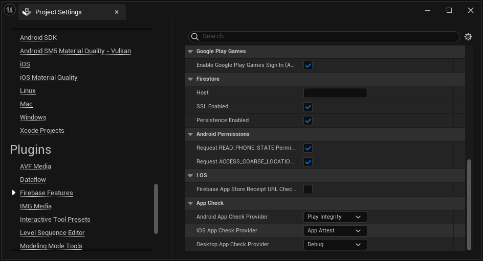

# App Check

App Check helps protect your API resources from abuse by preventing unauthorized clients from accessing your backend resources. It works with both Firebase services, Google Cloud services, and your own APIs to keep your resources safe.

## 1. Set up your Firebase project

1. Register your apps to use App Check with the Play Integrity, Device Check, or App Attest providers in the [Project Settings > App Check](https://console.firebase.google.com/project/_/appcheck) section of the Firebase console.
You usually need to register all of your project's apps, because once you enable enforcement for a Firebase product, only registered apps will be able to access the product's backend resources.
For detailed instructions on how to register with each provider, refer to the Android and iOS specific documentation.

2. *Optional*: In the app registration settings, set a custom time-to-live (TTL) for App Check tokens issued by the provider. You can set the TTL to any value between 30 minutes and 7 days. When changing this value, be aware of the following tradeoffs:
    - Security: Shorter TTLs provide stronger security, because it reduces the window in which a leaked or intercepted token can be abused by an attacker.
    - Performance: Shorter TTLs mean your app will perform attestation more frequently. Because the app attestation process adds latency to network requests every time it's performed, a short TTL can impact the performance of your app.
    - Quota and cost: Shorter TTLs and frequent re-attestation deplete your quota faster, and for paid services, potentially cost more. See [Quotas & limits](https://firebase.google.com/docs/app-check#quotas_limits).

  The default TTL is reasonable for most apps. Note that the App Check library refreshes tokens at approximately half the TTL duration.

## 2. Configure App Check

In the plugin's settings, select which *App Check Provider* you want to use for each platform, and restart the Editor to apply the changes.

## 3. Debug Config for Desktop
On desktop, select the *Debug Provider* and add an environment variable named `FIREBASE_APPCHECK_DEBUG_TOKEN` containing your debug token. The plugin will use it to satisfy the requirements to test in Editor.
