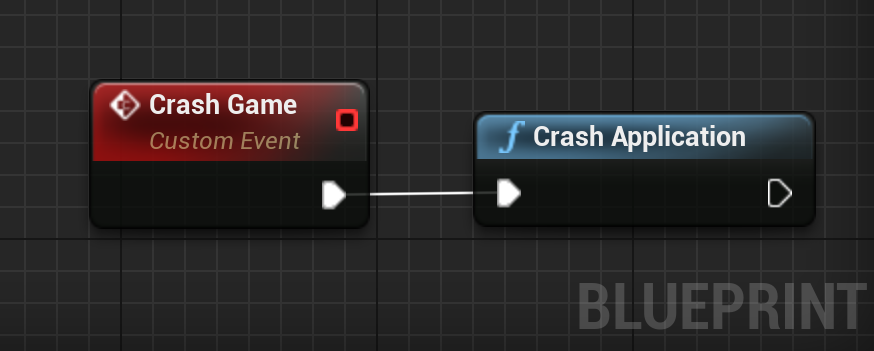

# Crashlytics

## **Step 1:** Enable Crashlytics in the Firebase console

1. Go to the Crashlytics dashboard in the [Firebase console](https://console.firebase.google.com/u/0/project/_/crashlytics).

2. Make sure your app is selected from the dropdown next to **Crashlytics** at the top of the page.

3. Click **Enable Crashlytics**.

## **Step 2:** Enable Crashlytics in your Game

To enable Crashlytics for your project:
1. Open your project's `Config/DefaultEngine.ini` in a text editor.
2. Add `CrashlyticsEnabled=true` under the `Firebase` category.
```ini
[Firebase]
CrashlyticsEnabled=true
; others entries as AdMobApplicationId, ...
```

## **Step 3:** Force a Test Crash to Finish Setup

To finish setting up Crashlytics and see initial data in the Crashlytics dashboard of the Firebase console, you need to force a test crash.

1. Add code to your app that you can use to force a test crash.  

<div class="code-switcher show-cpp-false">
<div class="switcher" >
<span class="sw-bp" onclick="switchBp()">Blueprints</span><span class="sw-cpp" onclick="switchCpp()">C++</span>
</div>
<div class="cpp">

```cpp
#include "Crashlytics/CrashlyticsLibrary.h"

void UMyClass::MyFunction()
{
	UCrashlyticsLibrary::CrashApplication();
}
```

</div>
<div class="bp">
<div class="bpcode">
<textarea readonly>
</textarea>

<button onclick="copyBlueprintCode(this)">Copy Code</button>
</div>
</div>
</div>

2. Build and run your app.

1. Force the test crash in order to send your app's first crash report:

	1. Open your app from your test device or emulator.

	1. In your app, press the "Test Crash" button that you added using the code above.

	1. After your app crashes, restart it so that your app can send the crash report to Firebase.

1. Go to the Crashlytics dashboard of the Firebase console to see your test crash.  
If you've refreshed the console and you're still not seeing the test crash after five minutes, enable debug logging to see if your app is sending crash reports.
