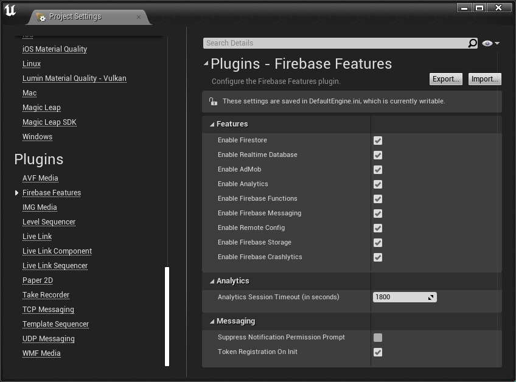

# Disabling Unused Features

If you don't use all features of the plugin, you might want to disable the unused ones.  
By default, all features are enabled.

To turn off features:
1. Open the Editor and go to `Edit` > `Project Settings...`.
2. In the left panel, scroll down under the `Plugins` category and click on `Firebase Features`.
3. Under the `Features` category, untick the checkboxes of the feature to disable.

    

?> Disabling AdMob requires to rebuild the plugin. Otherwise, the Mobile Ads SDK will terminate the application when it starts.
?> Some features depend on each other. Most features depend on Firebase Analytics. If your build failed after disabling a feature, another feature probably depends on it.
?> Rebuilding the plugin is required to disable a module on iOS.

After these steps the following happens:
1. The module's initialization is skipped when the plugin loads.
2. On Android, Java libraries of the disabled module aren't included in the build anymore. (iOS Objective-C frameworks require a rebuild to be excluded).
3. If you rebuild the plugin, all the code of the module will be removed from the build and methods will be no-ops.
4. If you rebuild the plugin, the module's C++ libraries won't be linked agaisnt the executable anymore.
