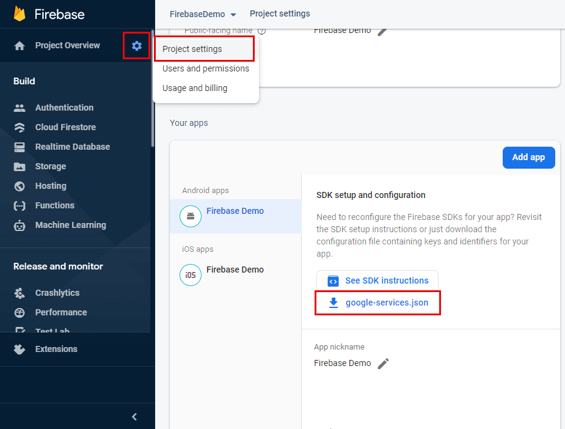

# Setup Firebase Features

> If you want to use the plugin for desktop only, the steps are the same as for Android.

## 1. Create a Firebase project.
To use Firebase, you need a Firebase project. To create one, go to [the Firebase Console](https://console.firebase.google.com/u/0/), click on `Add a project` and fill the fields asked for your new project.

## 2. Configure AdMob (optional)
If you plan to use AdMob, you have to configure it first.
1. Start by going to [AdMob Home Page](https://apps.admob.com/v2/home).  
2. Click `Application` > `Add an Application`. 
3. Once the application is added, go to `Application Settings`
4. Click on `Associate with Firebase`. This last step will ask you your application's package name that you choose while creating your Firebase Project.
5. You now need to go to `Apps` > `YourApp` > `App Settings`, copy the App ID and paste it in `DefaultEngine.ini` with the following structure: 

 ```ini
[Firebase]
AdMobApplicationId="ca-app-pub-XXXXXXXXXXXXXXXX~XXXXXXXXXX"
; Optional platform overrides, fall back to AdMobApplicationId if not set.
AndroidAdMobApplicationId="ca-app-pub-XXXXXXXXXXXXXXXX~XXXXXXXXXX"
iOSAdMobApplicationId="ca-app-pub-XXXXXXXXXXXXXXXX~XXXXXXXXXX"
```  

## 3. Install the File `google-services.json`

To work, Firebase requires the file `google-services.json` (or `GoogleService-Info.plist` for iOS). 
1. Go to `Project Overview > Project Settings` 
2. Click on  to download the `google-services.json` file.
3. Now that `google-services.json` is downloaded, you need to copy it to `<YourProject>/Services/`.  You can then start the Editor and proceed to the next step.

The following image shows the required steps to arrive to the Download button:

<div class="centered">



</div>

!> If the file is invalid or placed incorrectly, you will see an error message in the output log when you start the Editor with the message `Failed to create Firebase Application. Make sure the google-services.json file exists and is valid`. If this message doesn't appear, you can assume it is correctly configured.

!> Even if you plan to only use `Firebase - Features` on iOS, we recommend to download the `.json` file as well as the `.plist` to test in-Editor.

!> Desktop platforms use the Android `google-services.json` file.

## 4. Creating a Realtime Database (optional)
To create a Realtime Database for your project:
1. Go to the [Firebase Console](https://console.firebase.google.com/).
2. In the left panel, click on Realtime Database.
3. Click on `Create a Database`
4. Download and update your current `google-services.json`.

## 5. Configuration for C++ (optional)
This step is only required if you plan to use Firebase Features through C++ code.
Open  `YourProject.Build.cs` and add the following line to your module's constructor:
```csharp
PrivateDependencyModuleNames.Add("FirebaseFeatures");
```

!> You need to regenerate project files for the includes to work with your code editor.

## 6. Disabling unused modules (optional)
Starting with plugin version `1.4.12`, [these steps](/disableunusedfeatures) can be followed to disable parts of the plugin.
