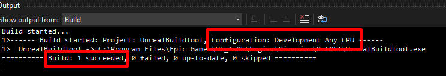

# Troubleshooting
## Useful logs for Android
If you experience a crash on startup when running your game on Android, you might first want to get the crash reason. To do so, open a terminal and run the following command with your Android device connected to your computer:
```sh
adb logcat
```
## iOS and Android

### Build Failed - `File google-services.json is missing.`
If your `google-services.json` is correctly placed but you get the following error while building.
```log
> File google-services.json is missing. The Google Services Plugin cannot function without it.
UATHelper: Packaging (Android (ASTC)):    Searched Location:
UATHelper: Packaging (Android (ASTC)): 5 actionable tasks: 5 executed
UATHelper: Packaging (Android (ASTC)):   X:\AFSProject\app\src\release\google-services.json
UATHelper: Packaging (Android (ASTC)):   X:\AFSProject\app\src\google-services.json
UATHelper: Packaging (Android (ASTC)):   X:\AFSProject\app\google-services.json
```
!> Note that it searches for a project named `AFSProject` and not for your own project name.

You can solve this error by disabling the plugin named `AndroidFileServer`.

<div class="centered">
  
</div>

### Failed to Sign In with Google: `DEVELOPER_ERROR` - Missing SHA1 Fingerprint.
The most common cause of this issue is not having set the SHA1 fingerprint of the application in the Firebase Console.
To solve the issue:
1. Follow [this guide](https://docs.unrealengine.com/4.27/en-US/SharingAndReleasing/Mobile/Android/DistributionSigning/) to sign the Unreal Engine application.
2. Get the SHA1 fingerprint of the app. [This guide](https://developers.google.com/android/guides/client-auth?authuser=0&hl=en) shows how to get the SHA1 fingerprint.
3. Set the SHA1 for your Android app in the Firebase Console under project's settings. 

<div class="centered">
  
</div>

### `Invalid application ID`
If the logs from `adb` indicate `Invalid application ID`, it means your AdMob application ID is invalid. The crash will disappear once you use the good one available on AdMob page.

!> The AdMob application ID is not an ad ID. It looks like `ca-app-pub-XXXXXXXXXXXXXXXX~XXXXXXXXXX`.

### Undefined symbols when packaging for Android with architecture `x86` or `x86_64`.
The plugin only comes with the Firebase C++ SDK compiled for `arm64-v8a` and `armeabi-v7a` for Android.

To add support for x86 or x86_64:
1. Download the binaries from the corresponding link [x86_64](https://drive.google.com/file/d/1_7M2rxWNOxnt_ijLTlb5P1e-1q5zNtNx/view?usp=sharing) or [x86](https://drive.google.com/file/d/1lgfNdldpKNL9MkImqRAoSyQADMbuN4B8/view?usp=sharing).
2. Unzip the files and copy them to `FirebaseFeatures/Source/ThirdParty/libs/android/{arch}`. i.e. for `x86_64`, the following file has to exist: `FirebaseFeatures/Source/ThirdParty/libs/android/x86_64/c++/libfirebase_app.a`.
3. Open `FirebaseFeatures/Source/FirebaseFeatures.Build.cs` and uncomment the line `297` (x86) or `298` (x86_64).

### Application crashes at startup
If your application crashes at startup after enabling the plugin, the reason is probably one of the following:
1. Invalid `google-services.json` or invalid `GoogleService-Info.plist`.
2. Invalid AdMob Application ID.

!> If you disabled AdMob for iOS without rebuilding the plugin, you still need a valid AdMob application ID. It is not required if you rebuilt the plugin.


### Error: Cook failed. Editor terminated with exit code `16384`.
If you encounter this issue:
1. Go in the Firebase Console. Click on `Realtime Database` in the left panel and create a new Realtime Database.
2. Download the `google-services.json` again and replace the one in your project with it.

### uses-sdk:minSdkVersion `x` cannot be smaller than version `y` declared in library `[com.google.firebase:firebase_messaging_cpp]`
As we use the latest available libraries for Firebase C++ SDK, you might encounter this error if you target an old SDK version.
You need to change the minSdk to the `y` value:
1. Open Project's Config.
2. Locate the `Platforms` > `Android` > `APK Packaging` > `Minimum SDK Version (19=KitKat, 21=Lolipop)` config.
3. Set its value to `y`.

### Packaging failed. Dependency resolved to an incompatible version
This error means that there is a plugin using Google's libraries of a different version, creating a conflict.  
There are two options to solve the issue:
1. Simply disable the other plugin.
2. Change Firebase Features' or the other plugin's Google's libraries version. 
It can get complicated and requires some code changes. If you are facing this issue and want to use this solution, please contact us by email.

### Android Build Errors when Using Unreal Engine 4.25: `org.gradle.api.internal.file.DefaultFilePropertyFactory$DefaultDirectoryVar$2 cannot be cast to org.gradle.api.file.Directory`

As the plugin uses recent Firebase libraries, an outdated Gradle version causes problem while packaging the project. To solve this issue, Gradle has to be updated. The following steps will guide you to update it:
1. Open the *UnrealBuildTool* project in Visual Studio. It can be found at `<EngineRoot>\Engine\Source\Programs\UnrealBuildTool\UnrealBuildTool.csproj`. 

<div class="centered">
  
</div>

2. In Visual Studio, open the file `Platform/Android/UEDeployAndroid.cs`.

<div class="centered">
  
</div>

3. On line **25**, replace 
```cs
private const string ANDROID_TOOLS_BUILD_GRADLE_VERSION = "com.android.tools.build:gradle:3.5.3";
```
by 
```cs
private const string ANDROID_TOOLS_BUILD_GRADLE_VERSION = "com.android.tools.build:gradle:4.0.0";
```

4. If your user doesn’t have write access to the Engine directoy, open `<EngineRoot>\Engine\Source\Programs\UnrealBuildTool\obj\Development` and delete or rename the following files to be able to generate a new build:
  - `UnrealBuildTool.exe`
  - `UnrealBuildTool.csproj.FileListAbsolute.txt`
  - `UnrealBuildTool.pdb`
 
<div class="centered">
  
</div>

5. Go back in Visual Studio and build Unreal Build Tool by right-clicking on the solution.

<div class="centered">
  
</div>

6. Make sure the solution is being built as **Development** and not **Debug**.


<div class="centered">
  
</div>

## Desktop
### Crashes when calling `Firebase - Features` functions.
If you encouter crashes when using the Desktop platform, the cause is very likely a missing `google-services.json` file. Follow the instructions [here](/installation) correctly. Make sure to check the Output Log after editor startup.

!> If you plan to only use `Firebase - Features` on iOS, you'll have to download the `.json` and the `.plist` to test it in editor.
