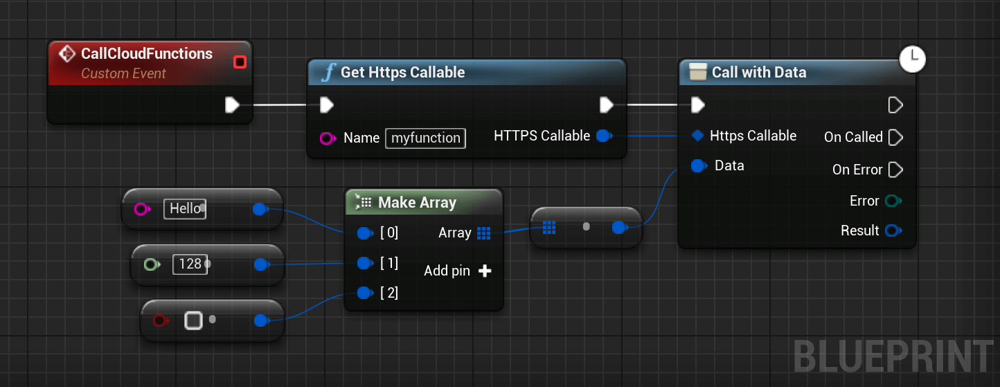

# User Messaging Platform
User Messaging Platform (UMP) is a Google SDK that helps you manage user consent, particularly for **privacy** regulations like **GDPR and CCPA**. It handles the display of consent forms, collects user choices regarding personalized ads and data usage, and passes that information to advertising SDKs like AdMob. Your code uses the UMP SDK to request and respect the user's consent status without needing to build and manage your own complex consent flow.

## Automatic Consent Handling

This part of the documentation will be added soon.

<!--
<div class="code-switcher show-cpp-false">
<div class="switcher" >
<span class="sw-bp" onclick="switchBp()">Blueprints</span><span class="sw-cpp" onclick="switchCpp()">C++</span>
</div>
<div class="cpp">

```cpp
// C++ code not available yet
```

</div>
<div class="bp">
<div class="bpcode">
<textarea readonly>

</textarea>

<button onclick="copyBlueprintCode(this)">Copy Code</button>
</div>
</div>
</div>

-->
